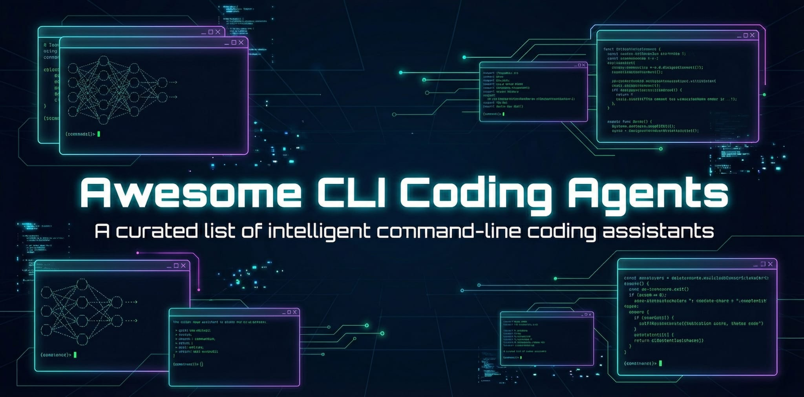

# Awesome CLI Coding Agents

  

  
  
  
  

A curated list of **130+ CLI coding agents** — AI-powered tools that live in your terminal, read/edit repos, and run commands — plus the **harnesses** that orchestrate, sandbox, or extend them.

> **Last updated:** 2026-09-22

### What is a CLI coding agent?

A CLI coding agent is an AI-powered tool that runs in your terminal and can autonomously read, write, and execute code in your repository. Unlike chat-based assistants, these agents have direct access to your filesystem, shell, and dev tools — they can edit files, run tests, commit changes, and iterate on errors. Think of them as AI pair programmers that live where you already work: the command line.

---

## Contents

- [Terminal-native coding agents](#terminal-native-coding-agents)
  - [Open Source](#open-source)
  - [OpenClaw ecosystem](#openclaw-ecosystem)
  - [Closed Source](#closed-source)

- [Harnesses & orchestration](#harnesses--orchestration)
  - [Session managers & parallel runners](#session-managers--parallel-runners)
  - [Orchestrators & autonomous loops](#orchestrators--autonomous-loops)
  - [Agent infrastructure](#agent-infrastructure)

- [Contributing](#contributing)

---

## Terminal-native coding agents

### Open Source

Forkable, extensible, and community-driven. Sorted by GitHub stars. Provider tags `[Company]` indicate the backing organization.

- **[Hermes Agent](https://github.com/NousResearch/hermes-agent)** `⭐ 248k` — Nous Research's self-improving CLI agent with persistent memory, automated skill creation, sandboxed code execution via Unix socket RPC, and multi-platform reach (Telegram/Slack/Discord/WhatsApp); supports 300+ models across multiple providers.

- **[OpenCode](https://github.com/anomalyco/opencode)** `⭐ 209k` — Terminal-native coding agent with 75+ provider support, LSP integration, and privacy-first design (formerly opencode-ai; now at opencode.ai).

- **[Claw Code](https://github.com/ultraworkers/claw-code)** `⭐ 195k` — Clean-room Python/Rust rewrite of Claude Code architecture using oh-my-codex; fastest repo in GitHub history to 100K stars. Born from the March 2026 Claude Code source leak. MIT.

- **[Codex CLI](https://github.com/openai/codex)** `⭐ 126k` `[OpenAI]` — OpenAI's local coding agent for reading/editing/running code, with an interactive TUI and tool execution. Apache-2.0.

- **[Pi](https://github.com/badlogic/pi-mono)** `⭐ 109k` — Minimal, adaptable terminal coding harness from the pi-mono toolkit; unified LLM API, TUI, skills, and MCP support.

- **[Gemini CLI](https://github.com/google-gemini/gemini-cli)** `⭐ 107k` `[Google]` — Google's terminal agent powered by Gemini, with tools for repo work and research. Apache-2.0.

- **[OpenHands](https://github.com/All-Hands-AI/OpenHands)** `⭐ 88.9k` — Open-source agentic developer environment (formerly OpenDevin) with CLI and web entrypoints; also has a lightweight [CLI-only package](https://github.com/OpenHands/OpenHands-CLI).

- **[Oh My OpenAgent](https://github.com/code-yeongyu/oh-my-openagent)** `⭐ 69.3k` — Multi-harness agent OS layered over OpenCode, Codex, and Pi; Team Mode runs several models on one job, with a hash-anchored tool harness and heavy context tuning. npm `oh-my-opencode`; the Codex-only variant installs via `npx lazycodex-ai install`. Source-available (SUL-1.0, not OSI).

- **[Cline CLI](https://github.com/cline/cline)** `⭐ 69.1k` — Model-agnostic autonomous agent for planning, file edits, command execution, and browser use.

- **[Open Interpreter](https://github.com/OpenInterpreter/open-interpreter)** `⭐ 68.4k` — Terminal tool that can execute code and actions; often used as a "do things on my machine" agent.

- **[Goose](https://github.com/aaif-goose/goose)** `⭐ 54.6k` — Local, extensible agent that can execute, edit, and test; designed to run on-device and integrate with MCP.

- **[Aider](https://github.com/Aider-AI/aider)** `⭐ 49.1k` — Pair-programming agent for editing files via diffs/patches, with strong git and multi-file workflows.

- **[Codewhale](https://github.com/Hmbown/CodeWhale)** `⭐ 41k` — Rust terminal coding agent (formerly `deepseek-tui`), bring-your-own-model across 30+ providers plus local vLLM/SGLang/Ollama. TUI or headless `codewhale exec` for scripts and CI; fleets pin a different provider, model, and reasoning tier per role, so a cheap model can direct an expensive one. Workspace snapshots, `/undo`, and a three-level permission posture. MIT.

- **[Continue CLI](https://github.com/continuedev/continue)** `⭐ 36k` — Open-source terminal extension for multi-model coding with local/privacy focus.

- **[Reasonix](https://github.com/esengine/DeepSeek-Reasonix)** `⭐ 35.7k` — Single Go binary coding agent built for long unattended runs; one local engine with four ways in (terminal, desktop app, browser, or editor over ACP). Config-driven providers in `reasonix.toml`, optional split executor/planner models, MCP plus an Extension Protocol sidecar system, plan mode, workspace sandbox, and per-turn checkpoints. MIT.

- **[OH-MY-PI](https://github.com/can1357/oh-my-pi)** `⭐ 32.7k` — Terminal coding agent ("Pi") with a TypeScript/Rust monorepo and local-first ergonomics.

- **[Deep Agents Code](https://github.com/langchain-ai/deepagents)** `⭐ 29.7k` `[LangChain]` — LangChain's official terminal coding agent built on the Deep Agents SDK; interactive TUI, file ops, shell access, subagents, headless mode, and human-in-the-loop approvals with any tool-calling LLM. PyPI `deepagents-code`.

- **[Crush](https://github.com/charmbracelet/crush)** `⭐ 28.2k` — Charmbracelet's glamorous agentic coding TUI in Go; multi-provider, LSP-aware, with rich terminal UI.

- **[Qwen Code](https://github.com/QwenLM/qwen-code)** `⭐ 28.1k` `[Alibaba]` — Alibaba Qwen's official CLI agent for Qwen coder models (workflow tool + repo operations). Apache-2.0.

- **[Kilo Code CLI](https://github.com/Kilo-Org/kilocode)** `⭐ 27.4k` — Agentic engineering platform with CLI; orchestrator mode, 100s of LLMs, skills, and checkpointing.

- **[Grok Build](https://github.com/xai-org/grok-build)** `⭐ 27k` `[xAI]` — xAI's official coding agent harness and TUI; fullscreen, mouse-interactive, and extensible. Apache-2.0.

- **[Roo Code CLI](https://github.com/RooCodeInc/Roo-Code)** `⭐ 24.3k` — Multi-mode CLI agent (architect/code/debug/orchestrator modes); Claude-like terminal interface with skills and checkpoints.

- **[Prime Agent](https://github.com/PrimeIntellect-ai/prime-agent)** `⭐ 21.2k` `[Prime Intellect]` — Self-improving RLM coding agent where a persistent IPython kernel is the model's only tool, so file edits, shell commands, skills, and subagents (`rlm(...)`) all happen as Python. A "Continual Harness" keeps memories, skills, and subagent specs as durable state that `/refine` updates from session evidence; daemon-backed sessions survive terminal disconnect, with goals, heartbeats, schedules, and bounded autonomous mode. Built on [Pi](https://github.com/earendil-works/pi). MIT.

- **[SWE-agent](https://github.com/SWE-agent/SWE-agent)** `⭐ 20.4k` — Agent for resolving real repo issues/PR tasks; frequently used in SWE-bench-style workflows.

- **[jcode](https://github.com/1jehuang/jcode)** `⭐ 20k` — Rust TUI agent optimized for RAM and startup latency (~28 MB PSS per session with local embeddings off), built for scaling many parallel sessions. Agent memory, swarm mode, browser automation, MCP, and 40+ providers with built-in OAuth login flows. MIT.

- **[Plandex](https://github.com/plandex-ai/plandex)** `⭐ 15.7k` — "Plan-first" CLI agent for building features across multiple files with structured steps and 2M token context.

- **[MiMo Code](https://github.com/XiaomiMiMo/MiMo-Code)** `⭐ 13.4k` `[Xiaomi]` — Xiaomi's official terminal coding agent; TUI + non-interactive modes, MCP, skills, hooks, git worktrees, and resumable sessions. Runs MiMo-V2.5-Pro or any mainstream provider; npm `@xiaomi-mimo/cli`. MIT.

- **[Codebuff](https://github.com/CodebuffAI/codebuff)** `⭐ 12.6k` — Multi-agent AI coding assistant with CLI support for collaborative coding workflows.

- **[Smol Developer](https://github.com/smol-ai/developer)** `⭐ 12.2k` — Embeddable developer agent that generates entire codebases from a prompt; designed to be embedded in apps.

- **[Trae Agent](https://github.com/bytedance/trae-agent)** `⭐ 12.1k` `[ByteDance]` — ByteDance's research-friendly CLI agent for software engineering tasks, with modular architecture and multi-LLM support. MIT.

- **[Kimi CLI](https://github.com/MoonshotAI/kimi-cli)** `⭐ 11.4k` `[Moonshot AI]` — Moonshot AI's CLI coding agent with skills, MCP support, and ACP IDE integration; being wound down in favor of Kimi Code. Apache-2.0.

- **[Claude Engineer](https://github.com/Doriandarko/claude-engineer)** `⭐ 11.2k` — Community-driven CLI for agentic Claude workflows with file management and iterative development.

- **[Claurst](https://github.com/Kuberwastaken/claurst)** `⭐ 10.3k` — Claude Code rewritten in idiomatic Rust with architectural breakdown; includes discoveries from the source leak (KAIROS persistent assistant, buddy system). MIT.

- **[Free Code](https://github.com/paoloanzn/free-code)** `⭐ 8.8k` — Fork of Claude Code with all telemetry removed, guardrails stripped, and all experimental features enabled (KAIROS, dream mode, companion system).

- **[ForgeCode](https://github.com/antinomyhq/forge)** `⭐ 7.6k` — AI pair programmer supporting 300+ models, with task management, custom agents, and large-scale refactor tooling.

- **[Kimi Code](https://github.com/MoonshotAI/kimi-code)** `⭐ 7.6k` `[Moonshot AI]` — Moonshot AI's next-gen TypeScript coding agent — a separate project from Kimi CLI. Event-sourced agent runtime with replayable state, context undo/compaction, and blob offloading; goal mode for bounded autonomous runs, background subagents, skills plus plugin manifests (prompts/MCP servers/commands), and subscription OAuth. npm `@moonshot-ai/kimi-code`. MIT.

- **[OpenSquilla](https://github.com/opensquilla/opensquilla)** `⭐ 7k` — Self-hostable microkernel agent runtime with a full CLI (`opensquilla chat` REPL, one-shot agent mode, gateway); autonomous file edits, shell and background processes, git tools, ML-based tier routing, sandboxing (Bubblewrap/Seatbelt), persistent memory, and 20+ providers. Apache-2.0.

- **[Kode CLI](https://github.com/shareAI-lab/Kode-cli)** `⭐ 5.2k` — ShareAI's open-source CLI agent for terminal-native coding with multi-provider support.

- **[Mistral Vibe](https://github.com/mistralai/mistral-vibe)** `⭐ 5k` `[Mistral]` — Mistral's CLI coding assistant for conversational repo interaction and edits. Apache-2.0.

- **[gptme](https://github.com/gptme/gptme)** `⭐ 4.4k` — AI agent in your terminal with support for persistent autonomous agents. Runs code, edits files, browses the web. Build long-lived self-modifying agents with git-backed memory via [gptme-agent-template](https://github.com/gptme/gptme-agent-template).

- **[Every Code](https://github.com/just-every/code)** `⭐ 4k` — Fork of Codex CLI with validation, automation, browser integration, multi-agents, theming, and multi-provider orchestration (OpenAI, Claude, Gemini). Apache-2.0.

- **[Grok CLI](https://github.com/superagent-ai/grok-cli)** `⭐ 3.5k` — Community CLI agent built on xAI's Grok models for terminal-based coding tasks.

- **[Devon](https://github.com/entropy-research/Devon)** `⭐ 3.5k` — Open-source pair programmer with a TUI; autonomous planning, execution, and debugging in Git workflows.

- **[Letta Code](https://github.com/letta-ai/letta-code)** `⭐ 3.4k` — Memory-first CLI coding agent built on the Letta platform (formerly MemGPT); persistent memory across sessions, model-agnostic (Claude/GPT/Gemini), skill learning, and context repositories.

- **[AutoCodeRover](https://github.com/AutoCodeRoverSG/auto-code-rover)** `⭐ 3.1k` — Autonomous program improvement agent; patches real GitHub issues using code search and analysis.

- **[Tau](https://github.com/huggingface/tau)** `⭐ 2.8k` `[Hugging Face]` — Small, readable Python coding agent in the terminal, inspired by Pi; CLI and Textual TUI over a provider-neutral core (Anthropic, Google, Mistral, OpenAI-compatible, Codex), with file/shell tools, durable JSONL sessions with branching, skills, and MCP-style extensions. Doubles as a teaching codebase for how agent harnesses are built. PyPI `tau-ai`. MIT.

- **[Atomic Agent](https://github.com/AtomicBot-ai/atomic-agent)** `⭐ 2.5k` — Local-first agent that runs the control loop on your machine: edits files, runs approved shell commands, drives your browser, and carries context across sessions, on local llama.cpp or cloud models. Interactive TUI, non-interactive `run`, and an OpenAI-compatible `serve` mode. Node.js, MIT.

- **[CodeMachine-CLI](https://github.com/moazbuilds/CodeMachine-CLI)** `⭐ 2.5k` — Community multi-agent CLI aimed at running coding workflows locally (vibe-coding oriented).

- **[Nanocoder](https://github.com/Nano-Collective/nanocoder)** `⭐ 2.5k` — Local-first CLI coding agent built by a community collective; bring your own model (Ollama, OpenRouter, or any OpenAI-compatible API), native tool calling with XML fallback, MCP support, and file-based custom commands and tools. MIT.

- **[Codel](https://github.com/semanser/codel)** `⭐ 2.5k` — Autonomous agent for performing complex tasks via terminal; runs in Docker with a web UI.

- **[open-codex](https://github.com/ymichael/open-codex)** `⭐ 2.4k` — Lightweight fork of Codex CLI with multi-provider support (OpenAI, Gemini, OpenRouter, Ollama).

- **[BitFun](https://github.com/GCWing/BitFun)** `⭐ 2.3k` — Rust coding agent with an interactive TUI and non-interactive `bitfun exec` runs; session fork/undo/redo/compact with a timeline, MCP and ACP, skills, hooks, and daemon-backed background tasks. Ships alongside, but builds independently of, a Tauri desktop app. MIT.

- **[RA.Aid](https://github.com/ai-christianson/RA.Aid)** `⭐ 2.2k` — Autonomous coding agent built on LangGraph with research/plan/implement pipeline; optional aider integration for near-full autonomy.

- **[Agentless](https://github.com/OpenAutoCoder/Agentless)** `⭐ 2.1k` — Lightweight approach to autonomous software engineering without persistent agent loops.

- **[Amazon Q Developer CLI](https://github.com/aws/amazon-q-developer-cli)** `⭐ 2k` `[AWS]` — AWS's agentic terminal chat for building apps, debugging, and DevOps with natural language. Apache-2.0.

- **[Neovate Code](https://github.com/neovateai/neovate-code)** `⭐ 1.6k` `[Ant Group]` — Ant Group's CLI agent with plugin system, multi-model/multi-provider support, MCP integrations, and headless automation mode. MIT.

- **[Ouroboros](https://github.com/razzant/ouroboros)** `⭐ 1.4k` — Self-evolving general agent with durable memory and identity across restarts; coordinates a subagent swarm and can rewrite its own implementation behind a review gate. Native desktop app or headless `ouroboros run/tasks/chat/logs/evolve` against a local gateway. Python, MIT.

- **[Maki](https://github.com/tontinton/maki)** `⭐ 1.1k` — Rust TUI coding agent optimized for context-token efficiency: tree-sitter file indexing, a sandboxed `code_execution` tool that chains tool calls without polluting the context window, tree-sitter-parsed permission gating for bash commands, and a memory tool. Extensible via neovim-like Lua plugins; 17+ providers, skills, MCP, ACP, and a Claude Code-compatible headless mode. MIT.

- **[VT Code](https://github.com/vinhnx/vtcode)** `⭐ 853` — Open-source coding agent with LLM-native code understanding and robust shell safety. Supports multiple LLM providers with automatic failover and efficient context management. MIT.

- **[hax](https://github.com/OleksandrChekhovskyi/hax)** `⭐ 810` — Minimalist terminal-native coding agent written in C; a single native binary that starts instantly and uses a few MB of RAM, leaving the machine's memory to a local model. First-class llama.cpp support (auto-discovers the served model and its runtime capabilities, no provider config) alongside OpenAI- and Anthropic-compatible endpoints, Codex via a ChatGPT subscription, and OpenRouter; streaming Markdown TUI that preserves native scrollback and a clean one-shot `-p` mode. Linux/macOS/BSD. MIT.

- **[Groq Code CLI](https://github.com/build-with-groq/groq-code-cli)** `⭐ 741` — Customizable, lightweight CLI powered by Groq's ultra-fast inference; extensible tools/commands with multi-model support.

- **[Dexto](https://github.com/truffle-ai/dexto)** `⭐ 651` — Coding agent and general agent harness with CLI/web/API modes; ships a production-ready coding agent with sub-agent spawning.

- **[Tura](https://github.com/Tura-AI/tura)** `⭐ 639` — Rust agent runtime that compiles a task into a single runtime-managed command graph instead of a model round trip per tool call, with backward planning and task-scoped compaction. Vendor-published DeepSWE comparison claims 77.5% fewer tokens than Codex CLI. TUI plus a Tauri GUI; npm `tura-ai`. AGPL-3.0.

- **[agentty](https://github.com/1ay1/agentty)** `⭐ 604` — Native C++26 terminal coding agent and drop-in claude-code alternative; single ~13.6 MB static binary with sub-millisecond cold start and zero runtime deps (no Node/Python/Electron). Sandboxed by default (Bubblewrap/`sandbox-exec`), model-agnostic (Claude, OpenAI, Groq, OpenRouter, Together, Cerebras, local Ollama), runs inside Zed over ACP, and drives air-gapped hosts over SSH. Linux/macOS/Windows/Termux. MIT.

- **[claw-code-agent](https://github.com/HarnessLab/claw-code-agent)** `⭐ 545` — Python-only Claude Code rewrite with zero external dependencies; born from the March 2026 Claude Code source leak, positioned as easier to hack on than the Rust/TypeScript reimplementations.

- **[g3](https://github.com/dhanji/g3)** `⭐ 519` — "Coding AI agent" in Rust: tool-running, repo interaction, skills system, and provider abstraction.

- **[Orca](https://github.com/echoVic/orca-agent)** `⭐ 507` — DeepSeek-native terminal coding agent in Rust with OS-level sandboxing (Seatbelt, bwrap, Landlock+seccomp, fail-closed), persistent goal mode with stall detection, background tasks, JS workflows, folder trust, and 1M-context auto-compaction. Single binary. MIT.

- **[Coro Code](https://github.com/Blushyes/coro-code)** `⭐ 369` — Open-source CLI coding agent, a free alternative to Claude Code; generate, debug, and manage code seamlessly.

- **[zot](https://github.com/patriceckhart/zot)** `⭐ 342` — Zero-overhead and lightweight coding agent harness with TUI/JSON/RPC modes, structured tools, reviewable file diffs, skills, extensions, and optional guardrails.

- **[LettaBot](https://github.com/letta-ai/lettabot)** `⭐ 326` — Personal AI assistant with persistent unified memory across Telegram, Slack, Discord, WhatsApp, and Signal; built on the Letta platform.

- **[Mini-Kode](https://github.com/minmaxflow/mini-kode)** `⭐ 307` — An educational AI coding agent CLI, intended as a readable reference implementation.

- **[nori-cli](https://github.com/tilework-tech/nori-cli)** `⭐ 181` — Multi-provider CLI built on Codex CLI; switch between Claude, Gemini, and Codex from the same native terminal.

- **[VibePod](https://github.com/VibePod/vibepod-cli)** `⭐ 167` — Unified CLI for running AI coding agents in isolated Docker containers; zero-config setup, local metrics, HTTP traffic tracking, and an analytics dashboard for side-by-side comparison.

- **[Octomind](https://github.com/Muvon/octomind)** `⭐ 142` — Open-source, model-agnostic AI agent runtime with community tap registry (`developer:rust`, `doctor:blood`, `legal:contracts`), MCP support with runtime self-extension, 13+ providers, and adaptive compression. Written in Rust. Apache-2.0.

- **[cursor-agent](https://github.com/civai-technologies/cursor-agent)** `⭐ 136` — Python-based agent replicating Cursor's coding assistant capabilities; supports Claude, OpenAI, and local Ollama models.

- **[Waveloom](https://github.com/Menfre01/waveloom)** `⭐ 132` — Go terminal-native coding agent with Bubble Tea TUI; DeepSeek V4 prompt caching for long-context efficiency; Claude Code-compatible UX with skill/MCP auto-discovery; four-tier context compaction, three subagent modes (Fork/Cold/Explore), permission engine, and plan mode. Single ~19 MB binary, zero runtime deps. Apache-2.0.

- **[DvalinCode](https://github.com/arthurpanhku/dvalincode)** `⭐ 118` — Provider-neutral, local-first coding agent (Chat/Cowork/Code modes) built for governance: an org policy engine, enforced network egress (per-request checks plus OS-sandboxed subprocesses via `sandbox-exec`/Bubblewrap), and a tamper-evident, hash-chained audit trail. Inline diff approval, durable session journal, built-in Web GUI from a single binary; works with any OpenAI-compatible endpoint (DeepSeek, OpenAI, Claude via OpenRouter, Groq, Ollama). Zero runtime deps. MIT.

- **[openHarness](https://github.com/zhijiewong/openharness)** `⭐ 98` — Open-source Claude Code alternative. 78 slash commands, 42 tools, MCP (stdio/HTTP/SSE + OAuth 2.1), hooks, subagents, plan mode. Works with Anthropic/OpenAI/Ollama/llama.cpp/LM Studio. Ships both npm and Python SDK. MIT.

- **[Codex Infinity](https://github.com/lee101/codex-infinity)** `⭐ 96` — Autonomous terminal coding agent (OpenAI Codex CLI fork) adding auto-continuation, parallel multi-agent runs, and CI repair loops.

- **[3code](https://github.com/capocasa/3code)** `⭐ 82` — Free and open source command-line coding agent built from the ground up to be efficient enough to use 3rd party token providers without a coding plan. Tight, no-frills interface, instant startup, works on macOS, Windows, Linux, and Termux; supports a wide range of providers including EU ones (Mistral, TensorX). MIT.

- **[San](https://github.com/genai-io/san)** `⭐ 80` — Go terminal-native runtime for specialized AI agents; provider-agnostic (Anthropic, OpenAI, Google, DeepSeek, Moonshot, Qwen, MiniMax, GLM), runs Claude Code skills/plugins/MCP unmodified, swappable search backends, custom personas, sandboxed subagents, lifecycle hooks, and a self-evolving memory loop. Single ~12 MB binary, zero runtime deps. Apache-2.0.

- **[San](https://github.com/genai-io/san)** `⭐ 80` — Go terminal-native runtime for specialized AI agents; provider-agnostic (Anthropic, OpenAI, Google, DeepSeek, Moonshot, Qwen, MiniMax, GLM), runs Claude Code skills/plugins/MCP unmodified, swappable search backends, custom personas, sandboxed subagents, lifecycle hooks, and a self-evolving memory loop. Single ~12 MB binary, zero runtime deps. Apache-2.0.

- **[Martty](https://github.com/openma-ai/Martty)** `⭐ 76` — Rust/ratatui terminal ACP client that bundles its own ACP layer, so agents that speak the protocol run in a native TUI rather than each shipping their own. Session history, MCP, and a `martty` single binary. MIT.

- **[Crab Code](https://github.com/lingcoder/crab-code)** `⭐ 76` — Rust-native coding agent built from scratch, deliberately mirroring Claude Code's toolset, permission model, and interaction patterns; Anthropic, OpenAI, DeepSeek, Bedrock, and Vertex providers. MIT.

- **[Keen Code](https://github.com/mochow13/keen-code)** `⭐ 66` — Go-based CLI coding agent focused on efficient context management — uses lean TurnMemory summaries instead of raw tool traces to maximize context efficiency. 9+ providers, skill-driven MCP servers, and full transparency with every prompt, design doc, and implementation plan saved as markdown. MIT.

- **[picocode](https://github.com/jondot/picocode)** `⭐ 61` — Minimal Rust-based coding agent focused on CI workflows and small codemods; multi-LLM with personas.

- **[QQCode](https://github.com/qnguyen3/qqcode)** `⭐ 53` — Lightweight CLI coding agent in Rust focused on speed, determinism, and developer control; supports skills.

- **[Jazz](https://github.com/lvndry/jazz)** `⭐ 53` — Generalist agent harness that runs your agent anywhere: terminal, scripts, cron, a GitHub Action that reviews PRs, or a Telegram/Discord bot you own. Define model, persona, toolset, and permissions in one JSON file; 18 providers (incl. local Ollama/llama.cpp) plus MCP, with permission-gated file, git, and web tools that ask for approval wherever you are. MIT.

- **[Smelt](https://github.com/leonardcser/smelt)** `⭐ 47` — Rust TUI coding agent; multi-provider (Anthropic, OpenAI, Ollama, GitHub Copilot, any OpenAI-compatible endpoint), four modes (Normal/Plan/Apply/Yolo), granular permission system, parallel subagents, vim keybindings, and headless scriptable mode. MIT.

- **[Zap](https://github.com/zap-coding-agent/zap-coding-agent)** `⭐ 33` — Skill-first Rust TUI coding agent that injects only the context your task needs — no system prompt bloat. Single binary, no runtime. Supports Claude, Gemini, OpenAI, and local models via LM Studio; code-indexed via SQLite for fast symbol lookup; MCP support. MIT.

- **[Nausicaa](https://github.com/jackispm/nausicaa-harness)** `⭐ 33` — TypeScript CLI/runtime for general-purpose agent tasks with addressable Lanes, an optional Teto observer lane, durable Run ledgers, daemon/worker lifecycle, and cross-Run A2A. npm `nausicaa-harness`, MIT.

- **[Grinta](https://github.com/josephsenior/Grinta-Coding-Agent)** `⭐ 30` — Local-first, provider-agnostic terminal coding agent built for long-horizon autonomous execution; durable state and recovery, context management, structured tool orchestration, LSP/DAP integration, and validation-gated completion. Python, MIT.

- **[Kolega Code](https://github.com/kolega-ai/kolega-code)** `⭐ 21` — Python terminal coding agent where the model writes its own multi-agent workflows (Gigacode): the runtime enforces concurrency caps and token budgets, journals every completed agent call to disk, and replays unchanged calls for free on resume. 15+ providers, MCP over stdio/SSE/streamable HTTP, ACP, sandboxed shell and filesystem tools, git worktrees, and a browser agent. Source-available (BUSL-1.1).

- **[Binharic](https://github.com/CogitatorTech/binharic-cli)** `⭐ 19` — A multi-provider "tech-priest persona" coding agent CLI (stylized, tool-using).

- **[memcode](https://github.com/memcode-ai/memcode)** `⭐ 17` — Go terminal coding agent that keeps persistent per-project memory in a local `.memcode` store — subsystems, prior work, failed approaches, corrected preferences — so sessions don't start from zero. Single binary that doubles as a self-hosted gateway answering on twelve chat channels, and ships an MCP memory server so other agents can read the same store. Runs on your own API keys, a local endpoint like Ollama, or a hosted account. MIT.

- **[OB-1](https://github.com/Overbrilliant/ob-1)** `⭐ 16` — Terminal coding agent that runs with no account, API key, or card against a free-model catalog. Persistent project memory builds a fact and relationship graph from real work and surfaces it with `/memory`. npm `ob1`. Apache-2.0.

- **[Darce](https://github.com/AmerSarhan/darce-cli)** `⭐ 10` — Ultralight (14 kB) multi-model CLI agent built with Ink; 7 tools, smart model routing across providers, streaming, session resume, and slash commands. MIT.

- **[Forge (Norvia Labs)](https://github.com/NorviaLabs/forge)** `⭐ 7` — Rust TUI coding agent unifying an AI agent, a vim-style code editor, and a shell in one keyboard-driven workspace; approval-aware command execution, durable SQLite session journal, and MCP server support. MIT.

- **[CLAII](https://github.com/agencyswarm/CLAII)** `⭐ 6` — CLI-first AI coding agent with multi-agent orchestration, MCP toolchains, and memory-persistent refactors.

- **[ipsupport-code](https://github.com/ipsupport-llc/ipsupport-code)** `⭐ 4` — Go terminal coding agent built for LM Studio and other OpenAI-compatible endpoints, single static binary; a small fat-tool schema tuned for weak local models, opt-in OS-level sandboxing (Seatbelt on macOS, Landlock on Linux) for its shell tool, and a reflect step after each task that writes new lessons to disk. MIT.

- **[Ferrum](https://github.com/ominiverdi/ferrum)** `⭐ 4` — Small Linux-only Rust-native coding agent with interactive and headless modes, ACP, safety-tiered native tools, durable JSONL sessions, Codex/ChatGPT OAuth, OpenAI-compatible providers, MCP, skills, and image input. MIT; primary development is on [Codeberg](https://codeberg.org/ominiverdi/ferrum).

- **[WorkGround2](https://github.com/KiddPhenix/WorkGround2)** `⭐ 2` — Local-first AI engineering workbench: one Go agent kernel behind CLI/TUI, web `serve`, a Wails desktop app, and IM bots (Feishu/WeCom/QQ), with multi-model providers, MCP + plugins, project memory, sandboxed/approved execution, and checkpoints + `/rewind`. MIT.

- **[MoCode](https://github.com/wanxunyang/mocode)** `⭐ 2` — Terminal coding agent (TypeScript) with durable lifecycle memory, hash-gated skill trust, and a built-in 61-task eval harness; drives any OpenAI-compatible backend (GLM, DeepSeek, Qwen, Ollama, vLLM) without a vendor key. npm `mocode-ai`. MIT.

- **[Kolkrabbi](https://github.com/onembyte/kolkrabbi)** `⭐ 1` — Go terminal coding agent (`kolk`) whose effort dial — low to max — picks which model runs each turn, not one model's thinking budget. Local models on this machine, the LAN, or one address you name; any OpenAI-compatible endpoint; or your Claude and ChatGPT subscriptions through each vendor's own CLI, no credential held. Checkpoints every write and logs each call's cost. Single static binary, Apache-2.0.

- **[Minicode](https://github.com/startupmini/minicode)** `⭐ 1` — Coding agent CLI built for real terminal work with a transparency-first philosophy: 37 built-in tools, MCP and LSP support, and a permission-first sandbox over a frozen zero-dependency runtime. Shadow-git checkpoints make every agent write reversible with a single `/undo`, and model calls, costs, and tool traces stream visibly in the TUI. npm `minicode-ai`, docs at [minicode.fun](https://minicode.fun). MIT.

- **[molt](https://github.com/solvyxtech/molt)** `⭐ 0` — Coding agent that won't say done on a false claim. Checks pass on disk (`.molt/done.yml`) or it refuses; receipts for accepts and refusals. Terminal and desktop. OpenAI-compatible or Anthropic. TypeScript, MIT.

### OpenClaw ecosystem

Projects built on, forked from, or inspired by [OpenClaw](https://github.com/openclaw/openclaw) — the open-source personal AI assistant. Sorted by GitHub stars.

- **[OpenClaw](https://github.com/openclaw/openclaw)** `⭐ 390k` — The original personal AI assistant you run locally; CLI with onboarding wizard, skills, tools, and multi-channel support (WhatsApp/Slack/Discord). MIT.

- **[nanobot](https://github.com/HKUDS/nanobot)** `⭐ 48.5k` — Ultra-lightweight ~4,000-line Python rewrite of OpenClaw; tool use, persistent memory, scheduled tasks, and multi-channel support (Telegram/Discord/WhatsApp). MIT.

- **[ZeroClaw](https://github.com/zeroclaw-labs/zeroclaw)** `⭐ 32.9k` — Fully autonomous AI agent runtime in Rust; trait-driven pluggable architecture (providers, tools, memory, channels), runs on minimal hardware (<5MB RAM), multi-channel CLI/Telegram/Discord/Slack, with sandboxed execution and hybrid vector+keyword search.

- **[NanoClaw](https://github.com/gavrielc/nanoclaw)** `⭐ 30.8k` — Security-first lightweight alternative to OpenClaw; runs agents in Apple containers/Docker with sandboxed execution, built on Anthropic's Agents SDK.

- **[PicoClaw](https://github.com/sipeed/picoclaw)** `⭐ 30k` — Ultra-lightweight personal AI assistant in Go inspired by OpenClaw; runs on $10 hardware with less than 10MB RAM.

- **[IronClaw](https://github.com/nearai/ironclaw)** `⭐ 12.6k` — OpenClaw rewritten in Rust by NEAR AI; WASM sandbox isolation, capability-based permissions, and prompt injection defense.

- **[NullClaw](https://github.com/nullclaw/nullclaw)** `⭐ 8.1k` — Fastest, smallest OpenClaw-compatible agent in Zig; 678KB static binary, ~1MB RAM, <2ms startup, 23+ providers, 18 channels. MIT.

- **[Clawith](https://github.com/dataelement/Clawith)** `⭐ 4.2k` — "OpenClaw for Teams" — multi-agent collaboration platform that scales OpenClaw to organizations. Apache-2.0.

- **[claw0](https://github.com/shareAI-lab/claw0)** `⭐ 3.4k` — 0-to-1 tutorial companion for the OpenClaw ecosystem; walks through building an agent harness from scratch, covering planning, context compression, and task persistence.

- **[Moltis](https://github.com/moltis-org/moltis)** `⭐ 2.9k` — Secure, auditable Rust-native alternative to OpenClaw; zero unsafe code, 2,300+ tests, built-in voice I/O, MCP servers, and multi-channel access. MIT.

- **[GitClaw](https://github.com/open-gitagent/gitclaw)** `⭐ 702` — Git-native AI agent framework where agent identity, rules, memory, tools, and skills are all version-controlled files. MIT.

- **[LionClaw](https://github.com/moshthepitt/lionclaw)** `⭐ 18` — Secure-first local AI CLI with a small auditable kernel, durable sessions, and installable skills. MIT.

### Closed Source

Proprietary agents — usable but not forkable or extensible at the source level.

- **[Claude Code](https://github.com/anthropics/claude-code)** `⭐ 148k` `[Anthropic]` — Anthropic's repo-aware terminal agent for code edits, refactors, and git workflows. Source-available, no OSS license.

- **[Warp](https://github.com/warpdotdev/Warp)** `⭐ 65.1k` `[Warp]` — Modern terminal with built-in AI agent mode; understands tasks, runs commands, edits files, and orchestrates multi-step workflows.

- **[GitHub Copilot in the CLI](https://github.com/github/copilot-cli)** `⭐ 11.2k` `[GitHub]` — GitHub's agentic CLI for repo/PR/issue workflows, command suggestions, and headless automation.

- **[Command Code](https://github.com/CommandCodeAI/command-code)** `⭐ 4k` `[CommandCode]` — CLI coding agent that continuously learns your coding style via taste-1 neuro-symbolic AI; adapts to preferences over time with project-specific taste profiles.

- **[Ante](https://github.com/AntigmaLabs/ante-preview)** `⭐ 2k` `[Antigma Labs]` — Single ~15 MB Rust binary terminal coding agent (research preview) with client–daemon architecture, interactive TUI + headless CLI, offline GGUF inference via embedded llama.cpp, and 12+ providers; strong verified Terminal-Bench 2.1 results. Core agent ships as a prebuilt binary.

- **[pool](https://github.com/poolsideai/pool)** `⭐ 426` `[Poolside]` — Poolside's terminal coding agent backed by its Laguna models; interactive TUI, headless `pool exec`, ACP client/server for Zed/JetBrains/Xcode, AGENTS.md, skills, and MCP. Binary distribution under a proprietary EULA.

- **[Auggie](https://github.com/augmentcode/auggie)** `⭐ 281` `[Augment Code]` — Augment's agentic coding CLI; interactive terminal agent plus headless `--print` mode for CI, custom slash commands from `.augment/commands`, and official GitHub Actions for PR review. Proprietary; requires an active subscription.

- **[Droid](https://github.com/Factory-AI/factory)** `⭐ 29` `[Factory]` — Factory's multi-model CLI coding agent; #1 on Terminal-Bench, specialized droids for different tasks, headless CI mode, and multi-interface support (CLI/IDE/Slack/Linear).

- **[TheGitAI](https://github.com/thegitai/thegitai-cli)** `⭐ 4` — Terminal coding agent across multiple frontier models with no API keys or provider account of your own; server-side web research and checkpointed edits that reverse cleanly. Source-visible client, proprietary server.

- **[FetchCoder](https://github.com/fetchai/fetchcoder-releases)** `⭐ 2` `[Fetch.ai]` — Terminal coding agent powered by ASI1, with interactive TUI, CLI, and API server modes plus MCP integration.

- **[Amp](https://sourcegraph.com/amp)** `[Sourcegraph]` — Sourcegraph's AI coding agent with a CLI for implementing tasks across real codebases.

- **[Junie CLI](https://junie.jetbrains.com)** `[JetBrains]` — JetBrains' LLM-agnostic CLI coding agent (EAP); supports GPT-5, Claude, Gemini, Grok with plan mode and CI/CD headless usage.

- **[Cortex Code CLI](https://www.snowflake.com/en/product/cortex-code/)** `[Snowflake]` — Snowflake's data-native AI coding agent CLI for building pipelines, analytics, and AI apps with enterprise governance.

- **[Devin](https://devin.ai)** `[Cognition]` — Cognition's autonomous AI software engineer with full shell/browser access, self-healing code, and PR collaboration.

- **[Cursor CLI](https://cursor.com/cli)** `[Cursor]` — Cursor's official command-line agent (`agent`) with shell mode, headless/CI support, parallel agents, and multi-model access.

- **[Tabnine CLI](https://docs.tabnine.com/main/getting-started/tabnine-cli)** `[Tabnine]` — AI-powered terminal coding assistant with agentic workflows; distributed as a Docker container, requires enterprise license.

- **[Mentat CLI](https://mentat.ai/docs/cli)** `[Mentat]` — Cloud-native coding agent CLI for managing remote Mentat agents from your terminal; auto-detects repo/branch context.

- **[Yaw](https://yaw.sh)** — Cross-platform terminal that auto-detects CLI coding agents (Claude Code, Codex, Gemini CLI, Vibe CLI) and opens a split-pane workflow.

---

## Harnesses & orchestration

### Session managers & parallel runners

Tools for running and managing multiple agent sessions side-by-side. Sorted by GitHub stars.

- **[Orca (Stably)](https://github.com/stablyai/orca)** `⭐ 75.5k` — Agentic development environment for a fleet of parallel agents: Codex, Claude Code, OpenCode, and Pi run side by side, each in its own git worktree, in Ghostty-class terminal splits with scrollback that survives restarts. Scriptable from an `orca` CLI (`worktree create`, `snapshot`, `click`, `fill`), with remote sessions and a click-to-prompt Chromium inspector. MIT.

- **[Multica](https://github.com/multica-ai/multica)** `⭐ 51.1k` — Self-hostable workspace where you assign issues to coding agents like teammates: they pick up work, report progress, raise blockers, and hand back for review. Drives 20 agent CLIs (Claude Code, Codex, Cursor, Copilot, Kimi, OpenCode) with no bundled model; every surface is scriptable through the same CLI and API the agents use. Go.

- **[herdr](https://github.com/herdrdev/herdr)** `⭐ 40.2k` — Agent multiplexer that lives in your terminal; run and coordinate multiple coding-agent sessions side by side, with a large third-party ecosystem (herdr-reviewr, herdr-remote, and more). Rust, Apache-2.0.

- **[AionUi](https://github.com/iOfficeAI/AionUi)** `⭐ 33k` — Free desktop Cowork app that runs OpenClaw, Hermes, Claude Code, Codex, OpenCode, and 20+ other CLI agents around the clock; custom agent configs, multi-session management, cross-platform (macOS/Windows/Linux). Apache-2.0.

- **[vibe-kanban](https://github.com/BloopAI/vibe-kanban)** `⭐ 28.2k` — Kanban interface for administering AI coding agents.

- **[cmux](https://github.com/manaflow-ai/cmux)** `⭐ 27.3k` — Open-source platform for running multiple coding agents in parallel.

- **[Paseo](https://github.com/getpaseo/paseo)** `⭐ 18.1k` — Self-hosted daemon that runs Claude Code, Codex, Copilot, OpenCode, and Pi agents in parallel on your own machines, driven from a `paseo` CLI (`run --worktree`, `ls`, `attach`, `send`) or from desktop, web, and mobile clients; voice control, no telemetry. TypeScript, AGPL-3.0.

- **[Superset](https://github.com/superset-sh/superset)** `⭐ 14.5k` — A terminal built for coding agents; orchestrates parallel agent sessions.

- **[Agent Orchestrator (AO)](https://github.com/Untrivial-ai/agent-orchestrator)** `⭐ 12.3k` — Desktop app and `ao` CLI for supervising Claude Code, Codex, Cursor, OpenCode, and 20+ other agents in parallel; every Git-backed session gets its own worktree, branch, and pull request, and CI failures, review comments, and merge conflicts are routed back to the agent that owns them. Go + Electron, Apache-2.0.

- **[Claude Squad](https://github.com/smtg-ai/claude-squad)** `⭐ 8.5k` — tmux-based harness to run and manage multiple Claude Code sessions side-by-side.

- **[Emdash](https://github.com/generalaction/emdash)** `⭐ 5.8k` — Run multiple coding agents concurrently with coordinated workflows.

- **[CodexMonitor](https://github.com/Dimillian/CodexMonitor)** `⭐ 4.3k` — Coordinate multiple Codex agents across local workspaces.

- **[Toad](https://github.com/batrachianai/toad)** `⭐ 3.4k` — Agent orchestrator for running and managing parallel CLI coding sessions.

- **[agent-of-empires](https://github.com/njbrake/agent-of-empires)** `⭐ 3.3k` — Manage multiple Claude Code, OpenCode, Codex CLI, Gemini CLI, Pi, Copilot CLI, Mistral Vibe, and Factory Droid agents from a TUI or web UI (mobile-friendly). Rust, uses tmux + git worktrees. MIT.

- **[Crystal](https://github.com/stravu/crystal)** `⭐ 3.1k` — Execute multiple Codex and Claude Code sessions in parallel git worktrees.

- **[qwen-audio-agent](https://github.com/QwenAudio/qwen-audio-agent)** `⭐ 2.7k` — Realtime voice frontend (TUI, web UI, desktop orb) that dispatches work to a backend coding-agent CLI of your choice over native ACP — Qwen Code, Claude Code, Codex, OpenCode, Kimi Code, DeepSeek. Tasks run asynchronously in the background while the conversation continues, with barge-in and a local wake word. Apache-2.0.

- **[supacode](https://github.com/supabitapp/supacode)** `⭐ 2.4k` — Native macOS coding agent orchestrator.

- **[Agent Teams AI](https://github.com/777genius/agent-teams-ai)** `⭐ 2.2k` — Cross-platform desktop control plane with integrated terminals and a Kanban board for autonomous coding-agent teams; agents coordinate, message each other, and review work across Codex, Claude Code, OpenCode, Cursor, Grok, GitHub Copilot, Kiro, Z.AI, MiniMax, Kimi, and 75+ model providers. AGPL-3.0.

- **[Cate](https://github.com/0-AI-UG/cate)** `⭐ 2.1k` — Desktop app that runs terminals, Claude Code agent panels, editors, and browsers on an infinite zoomable canvas; multiple agent sessions sit side by side and panels can dock into tabs or detach into separate windows. Built with Electron and node-pty. MIT.

- **[Orkas](https://github.com/Orkas-AI/Orkas)** `⭐ 2.1k` — Electron desktop app that spawns and drives real local coding-agent sessions over each tool's own protocol (Claude Code, Codex, OpenCode, OpenClaw, Hermes) — for Codex it speaks `codex app-server` JSON-RPC directly — plus a bundled agent harness of its own. TypeScript.

- **[mux](https://github.com/coder/mux)** `⭐ 2k` — Desktop application for isolated, parallel agentic development.

- **[Nimbalyst](https://github.com/nimbalyst/nimbalyst)** `⭐ 1.8k` — Open-source visual workspace for building with Codex, Claude Code, and more; manage your agents, edit the work visually, and track tasks. MIT.

- **[CLI Agent Orchestrator (CAO)](https://github.com/awslabs/cli-agent-orchestrator)** `⭐ 1.3k` — AWS's hierarchical multi-agent orchestration via tmux with intelligent task delegation patterns.

- **[jean](https://github.com/coollabsio/jean)** `⭐ 1.3k` — Administer multiple projects, worktrees, and sessions with Claude CLI.

- **[Parallel Code](https://github.com/johannesjo/parallel-code)** `⭐ 1k` — Desktop app for running multiple AI coding agents (Claude Code, Codex CLI, Gemini CLI) simultaneously in isolated git worktrees.

- **[agent-deck](https://github.com/asheshgoplani/agent-deck)** `⭐ 940` — Terminal session manager for AI coding agents — one TUI for Claude, Gemini, OpenCode, Codex, and more. Worktree-aware, MCP integration, 8+ contributors. MIT.

- **[Agent Sessions](https://github.com/jazzyalex/agent-sessions)** `⭐ 871` — Local-first macOS session-history browser for AI coding agents, with transcript search across Codex, Claude Code, OpenCode, Cursor Agent, Hermes, Copilot CLI, OpenClaw, and more; resume is available where the underlying CLI supports it. MIT.

- **[hcom](https://github.com/aannoo/hcom)** `⭐ 512` — Hooks Claude Code, Antigravity, Codex, OpenCode, Kilo, and Cursor into a shared messaging and event bus; agents message, observe, and spawn each other mid-turn without changing how you use them. TUI dashboard, collision detection, cross-device relay. Rust, MIT.

- **[Proliferate](https://github.com/proliferate-ai/proliferate)** `⭐ 505` — Open-source local and cloud agent IDE for Claude Code, Codex, Gemini CLI, OpenCode, and similar coding agents; parallel workspaces, subagents, plugins, MCP, and review/merge flow around real CLI sessions.

- **[agent-manager](https://github.com/YoanWai/agent-manager)** `⭐ 493` — Go tmux TUI for running Claude Code, Codex, OpenCode, Grok, Gemini CLI, Pi, and Hermes side by side: live per-pane status, prompts sent into a pane without attaching, git worktrees, and in-terminal full-file diff review with line comments fed back to the agent. Apache-2.0.

- **[amux](https://github.com/mixpeek/amux)** `⭐ 492` — Agent multiplexer for running dozens of parallel Claude Code sessions with web dashboard, self-healing watchdog, kanban board, agent-to-agent REST API, and mobile PWA. Single Python file, Python 3 + tmux. MIT.

- **[Catnip](https://github.com/wandb/catnip)** `⭐ 491` — Containerized environment + worktree automation for running multiple coding agents in parallel (optimized for Claude Code).

- **[AgentBox](https://github.com/madarco/agentbox)** `⭐ 486` — Run multiple coding agents in parallel, each teleported into its own sandboxed VM (local Docker, self-hosted, or cloud: Hetzner/Daytona/Vercel/E2B); sub-second checkpoints, per-box browser/VS Code/shells, git creds kept on the host. Works with Claude Code, Codex, and OpenCode. MIT.

- **[ntm](https://github.com/Dicklesworthstone/ntm)** `⭐ 449` — Named Tmux Manager — spawn, tile, and coordinate multiple AI coding agents (Claude, Codex, Gemini) across tmux panes with a TUI command palette.

- **[Calyx](https://github.com/yuuichieguchi/Calyx)** `⭐ 327` — Native macOS terminal built on libghostty for supervising coding agents in parallel: one approval inbox for Claude Code and Codex permission prompts and Grok and pi tool calls, a working/blocked/idle/done sidebar, in-terminal diff review, and MCP tools for agents. Swift, MIT.

- **[Vicoa](https://github.com/vicoa-ai/vicoa)** `⭐ 274` — Agentic IDE and AI orchestrator for running a team of coding agents (Claude Code, Codex, OpenCode, Gemini, Cursor, GitHub Copilot, Kimi, Hermes) from desktop, web, or mobile, with real-time sync, parallel git worktrees, and push notifications. AGPL-3.0.

- **[vibe-tree](https://github.com/sahithvibudhi/vibe-tree)** `⭐ 267` — Execute Claude Code tasks in parallel git worktrees.

- **[MulmoTerminal](https://github.com/receptron/mulmoterminal)** `⭐ 224` — Browser grid of live Claude Code / Codex / Grok sessions started with one `npx` command, no Electron; each cell is a real PTY, color-coded working / needs-you / done from the CLI's own activity hooks rather than scraped scrollback, with a per-kind chime and Web Push to your phone. tmux-backed persistence across restarts, git worktrees with one-click PRs, and per-session model, context and token readouts. MIT.

- **[Ivy Tendril](https://github.com/Ivy-Interactive/Ivy-Tendril)** `⭐ 198` — Desktop and web app for running CLI coding agents (Claude Code, Codex, Copilot, Gemini, OpenCode) in parallel isolated git worktrees, with diff review, approval, and automated verification gates before changes land. Source-available (FSL-1.1-ALv2).

- **[Tempest](https://github.com/tempestai-dev/tempest)** `⭐ 178` — Tauri agentic development environment running Claude Code, Codex, Gemini, and other CLI agents in parallel; embedded xterm.js terminals, hook-based per-agent status detection, token-usage intelligence, isolated database branches, and multi-agent session management. Apache-2.0.

- **[amux](https://github.com/andyrewlee/amux)** `⭐ 161` — Terminal UI designed for running multiple coding agents in parallel.

- **[CliDeck](https://github.com/rustykuntz/clideck)** `⭐ 158` — WhatsApp-like browser dashboard for managing multiple CLI coding agents (Claude Code, Codex, Gemini CLI, OpenCode) with live status detection, session resume, autopilot routing, and full control from a phone while away. MIT.

- **[CliDeck](https://github.com/rustykuntz/clideck)** `⭐ 158` — WhatsApp-like browser dashboard for managing multiple CLI coding agents (Claude Code, Codex, Gemini CLI, OpenCode) with live status detection, session resume, autopilot routing, and full control from a phone while away. MIT.

- **[GridBash](https://github.com/jasonsuhari/gridbash)** `⭐ 134` — Cross-platform Rust terminal grid running Codex, Claude Code, Gemini CLI, and other real PTY-backed agents side by side; selected-pane input, optional git-worktree isolation, and nightly cross-platform binaries. MIT.

- **[tlbx](https://github.com/tlbx-ai/tlbx)** `⭐ 111` — Self-hosted browser control station for remote coding agents (formerly MidTerm): runs Codex, Claude Code, Gemini CLI, Grok Build, OpenCode, Copilot CLI, and any PTY app on the machines that hold your repos and credentials, supervised from any desktop, tablet, or phone browser. Sessions survive disconnects; `mt` CLI helpers expose history, multi-session dispatch, and the control plane as JSON so agents can drive it. AGPL-3.0.

- **[ADHDev](https://github.com/vilmire/adhdev)** `⭐ 97` — Self-hosted daemon plus web dashboard for driving local CLI coding agents (Claude Code, Codex, Cursor CLI, Antigravity, Kimi) from a browser or phone: live session state, remote approvals carrying the command text, and exact session resume. Repo Mesh claims queued tasks into isolated git worktrees and the Refinery gates finished branches and fast-forwards them back to `main`. P2P-first over WebRTC, so code stays on your machine. npm `adhdev`, TypeScript, AGPL-3.0.

- **[Garcon](https://github.com/cfal/garcon)** `⭐ 86` — Self-hosted browser and mobile workspace for running and steering parallel Claude Code, Codex, Cursor Agent, OpenCode, Amp, Droid, and Pi sessions, with integrated terminal, files, diff review, Git/PR workflows, mobile approvals, scheduling, and cross-agent transfers. GPL-3.0.

- **[run-kit](https://github.com/sahil87/run-kit)** `⭐ 60` — Remote, phone-first web console for tmux: spawn and watch coding agents in parallel git worktrees, agent-agnostic and no database, with push notifications and local-port proxying to your browser. Go, MIT.

- **[Better Agent](https://github.com/ofekron/better-agent)** `⭐ 59` — Local web workspace that launches and supervises native Claude, Codex, and Gemini CLI sessions with parallel delegation, persistent state, approval gates, file access, and restart recovery. Source-available; free for non-commercial use.

- **[Agent AFK](https://github.com/griffinwork40/agent-afk)** `⭐ 55` — Coding-agent harness built for unattended, away-from-keyboard runs across four surfaces sharing one session manager: one-shot CLI, REPL, cron-friendly headless daemon, and a Telegram bot. Editable agent loop (prompts, permission gates, model routing, explicit terminal states), MCP (stdio/HTTP/SSE + OAuth), lifecycle hooks, background subagents, plan mode, cross-session memory, and an append-only trace receipt (`afk trace show`). Works with Anthropic and any OpenAI-compatible endpoint (GPT, Codex, local MLX/llama.cpp/Ollama). npm `agent-afk`, Node ≥22. Apache-2.0.

- **[Clave](https://github.com/codika-io/clave)** `⭐ 50` — Native macOS app for running multiple AI coding-agent CLIs (Claude Code, Gemini CLI, Codex) in parallel — split/grid terminal layouts, per-project session groups, a built-in git panel, and remote sessions over SSH. Fully local, no account. Electron. MIT.

- **[showagent](https://github.com/aytzey/showagent)** `⭐ 48` — Bubble Tea TUI that unifies the local session stores of Claude Code, Codex, Gemini CLI, and OpenCode: fuzzy search grouped by workspace, resume via each agent's own CLI, branch local copies, and cross-agent transcript conversion into the target's native format. Scriptable (`list --json`), fully local, single Go binary. MIT.

- **[intentic](https://github.com/intentic/intentic)** `⭐ 44` — Self-hosted workspace that gives each coding agent a persistent sandbox on hardware you own: agents work in real checkouts in their own git worktrees behind PTY terminals, and you approve the riskier calls and read every diff before it lands. A Rust host agent pairs the machine over an outbound-only Cloudflare tunnel, so there are no inbound ports to open; the workspace opens in any browser or the desktop app. Runs Claude Code, Codex, Grok, Kimi Code, and Gemini on your own subscriptions. TypeScript, MIT.

- **[vibepanel](https://github.com/jiangmuran/vibepanel)** `⭐ 29` — Self-hosted web console for running many Claude Code and Codex sessions in parallel from a browser or a phone; each session lives in tmux, so agents keep running through panel restarts, upgrades and dropped connections. Hook-reported session state, token usage, and read-only share links. Source-available (PolyForm Noncommercial).

- **[Superagent](https://github.com/pungme/superagent-desktop)** `⭐ 26` — macOS desktop client for Claude Code and Codex: gives the agent a real browser it can navigate and drive, an iOS Simulator window for installing and screenshotting apps, and a phone companion app for remote monitoring over an end-to-end encrypted relay. Electron, SwiftUI, and a Cloudflare Worker relay. MIT.

- **[agents-cli](https://github.com/phnx-labs/agents-cli)** `⭐ 23` — CLI to install, version-pin, and run many coding-agent harnesses (Claude Code, Codex, Gemini CLI, Cursor, OpenCode, Grok); shared skills/MCP/rules, parallel teams in isolated terminals, session index, and SSH fleet dispatch. npm `@phnx-labs/agents-cli`. Apache-2.0.

- **[repomon](https://github.com/AliHamzaAzam/repomon)** `⭐ 21` — Run a fleet of AI coding agents (Claude Code, Codex, Aider) across many repos, branches, and git worktrees from one tmux-backed terminal. Four-zoom TUI (fleet, split, babysit grid, focus), needs-you triage, durable sessions that survive restarts.

- **[Claudescope](https://github.com/vladar107/claudescope)** `⭐ 18` — Local, read-only CLI that serves a web UI to browse, search, and analyze AI coding-agent transcripts across Claude Code, Codex, Junie, pi, opencode, and Copilot CLI — sessions merged by working directory, with full-text search and token-cost analytics. npm, cross-platform. MIT.

- **[construct](https://github.com/construct-worlds/construct)** `⭐ 17` — Terminal-native agentic development environment: fleet TUI for coding agent CLIs (Codex, Claude Code, Antigravity, Grok) with fork/merge, collaborative Program Markdown orchestration, generative widgets, agent-to-agent orchestration. Single Rust binary.

- **[CLITrigger](https://github.com/HyperAITeam/CLITrigger)** `⭐ 14` — Self-hosted web UI for orchestrating Claude Code, Codex, and Gemini CLIs in parallel git worktrees. Features multi-agent discussion mode (architect/developer/reviewer debate before implementation), cross-project Morning Review Queue, scheduled execution with rate-limit auto-recovery, and a built-in Git client. MIT.

- **[Podiom](https://github.com/Podiom/Podiom)** `⭐ 14` — Self-hosted control plane for local Claude Code and Codex CLI agents: durable named agents whose chat sessions replay onto a fresh backing CLI session across provider/profile switches, a shared project ledger, an embedded scheduler, and autonomous goals. Single Go binary with an embedded Svelte web UI, no cloud dependency. MIT.

- **[multi-agent-workflow-kit](https://github.com/laris-co/multi-agent-workflow-kit)** `⭐ 11` — Orchestrate parallel AI agents in isolated git worktrees with shared tmux visibility.

- **[pi-boss](https://github.com/skyfallsin/pi-boss)** `⭐ 11` — Multi-agent orchestration for the Pi coding agent; spawns sub-agents in visible tmux panes with task delegation, monitoring, and coordination. MIT.

- **[Polter](https://github.com/Lugia123/polter)** `⭐ 11` — Ghostty fork in which one AI CLI leads a team of the others: the lead session reads the text on the other tabs, types into them, opens new tabs, and is notified when a session goes quiet. Per-plugin provisioning for Claude Code, Codex, Gemini, Kimi, opencode, Qwen, and DeepSeek. Fully offline, no account. Zig, MIT.

- **[cliclaw](https://github.com/choiyounggi/cliclaw)** `⭐ 8` — macOS daemon to drive Claude Code, Codex, Gemini, and Pi from Telegram — an independent session per chat, a confirm gate for dangerous commands (bash/git/cloud deletes), and secret auto-masking. npm `@younggichoi/cliclaw`, TypeScript/Bun. MIT.

- **[tmuxlet](https://github.com/CodefiLabs/tmuxlet)** `⭐ 8` — Rust CLI that runs interactive coding CLIs (Claude, Codex, Gemini, opencode, pi, Cursor) inside tmux and exposes a normalized `claude -p` style blocking interface. Single binary, zero deps. Works against the regular Claude subscription bucket (not the separate Agent SDK credit) by driving interactive Claude Code from the outside.

- **[iris](https://github.com/itzenata/iris-tui)** `⭐ 6` — Live TUI supervisor for every active Claude Code session: status, tokens, estimated cost, and one-pane approval of pending tool calls via a PreToolUse hook. Rust, MIT.

- **[mix2](https://github.com/elleryfamilia/mix2)** `⭐ 5` — Terminal app that turns two coding agents into one team; one question, both investigate independently, reconcile or disclose disagreements, one answer. Works with Claude Code, Codex, Cursor, OpenCode, and Copilot CLI. Rust + TypeScript, MIT.

- **[taskpods](https://github.com/yanairon/taskpods)** `⭐ 5` — Lightweight, agent-agnostic CLI that runs Claude Code, Codex CLI, Gemini CLI, opencode, aider, or any command in isolated Git worktrees and branches, with list, PR, cleanup, and abort lifecycle commands. Python, MIT.

- **[Claudette](https://github.com/Olorin-ai-git/claudette)** `⭐ 3` — Native iOS/Android/Apple TV mobile control plane for local CLI coding-agent sessions: real PTY plus context/cost gauge, agent tree, voice, and Take the Wheel handoff. Companion CLI `npx claudette setup`. MIT.

- **[Agent CLI Menu](https://github.com/roypadina/AgentCliMenu)** `⭐ 2` — macOS TUI and menu-bar app to start or resume Claude Code and Codex sessions; frecency project launcher plus full-transcript fuzzy search across past sessions, with a working-directory confidence gate. MIT.

- **[tring](https://github.com/matogen/tring.chat)** `⭐ 2` — Browser-based terminal deck that runs up to 16 Claude Code, other agent, or plain shell sessions per project from a local Node daemon; one session fills the center of the screen while the rest render as live thumbnails, and a tile turns green when its session finishes and is waiting for input (quiet output, OSC 133 prompt, bell, or a Claude Code Stop hook). Ctrl+Space then a digit jumps to a fixed slot. npm `tring-chat`. MIT.

- **[TaskHandoff](https://github.com/edgestorage/task-handoff)** `⭐ 2` — Self-hosted control plane for running Docker-based Codex workspaces on local and remote machines: each task gets its own isolated checkout, changes pass a diff review gate before landing in your repository, and work is handed off between a planner agent, an executor agent, and a human reviewer. `task-handoff` CLI plus a web control plane. Apache-2.0.

- **[Agent Workbench](https://github.com/cvelasquez/agent-workbench)** `⭐ 2` — Local web UI that runs the unmodified Claude Code, Codex, OpenCode and Antigravity CLIs in a pseudo-terminal, with tabs that survive a reload, one browsable history for all four, conversation hand-off between CLIs and full-text search. Windows-first, MIT.

- **[postmortemthis](https://github.com/Softeria/postmortemthis)** `⭐ 1` — Runs every coding-agent CLI you have (Claude Code, Codex, Gemini, Qwen, Vibe) in parallel and read-only over your diff, then synthesizes their reviews into one ship / no-ship verdict. A cross-model second opinion before you ship. MIT.

- **[AgentX](https://github.com/ArcheMind/agentx)** `⭐ 0` — Native-first runtime manager for Claude Code, Codex CLI, DeepSeek Harness, Gemini CLI, OpenCode, and Pi. Launch or resume each agent through its own CLI while preserving native configurations, credentials, and session stores. Go, MIT.

- **[clisweave](https://github.com/uhuntu/clisweave)** `⭐ 0` — Tiny, dependency-free CLI wrapper unifying Claude Code, Codex CLI, and Kimi CLI: normalizes flags across the three tools, plus a cross-tool numbered session list, resume-by-row-number, and an LLM-judged topic search that finds relevant past sessions by content, not just exact keyword match. Single Python package, no daemon. MIT.

- **[PATAPIM](https://patapim.ai)** — Terminal IDE with a 9-terminal grid for running multiple CLI coding agents simultaneously; features AI state detection, built-in Whisper voice dictation, LAN remote access, and an embedded MCP browser. Built with Electron and node-pty. Freemium.

- **[Bwee](https://bwee.app)** — Desktop app for CLI coding agents where users build their own views (BYOUI) — custom tools and dashboards that live alongside the terminal. Persistent sessions and task management. macOS.

- **[Even](https://even.dev)** — Agent-native desktop workspace: a native terminal (real shell per pane), a real in-app browser, one-click self-hosted services, and local models in one window. Runs multiple coding-agent CLIs (Claude Code, Codex, and others) side by side in the same panes you work in, each under a deny-by-default policy with a tamper-evident audit trail.

- **[Unpeel](https://unpeel.com)** — Native macOS app built on the Ghostty terminal engine for running and remote-controlling multiple CLI agent sessions (Claude Code, Codex, Gemini CLI, Amp, OpenCode, Cline, and more): persistent terminals that survive app restarts, git worktree isolation for parallel agents, busy/attention notifications, and iPhone remote control via a self-hosted E2E-encrypted relay. Closed-source; free with paid remote access.

- **[defract](https://defract.dev)** — macOS GUI harness for Claude Code. Drives an opinionated lifecycle (story → design → architecture → implementation → review) with a visual design stage and review gates, not just parallel runs. Local-first, bring-your-own-Anthropic, free.

- **[CodeAgentSwarm](https://www.codeagentswarm.com)** — macOS and Windows desktop workspace for running Claude Code, Codex CLI, Antigravity CLI, OpenCode, Kimi Code, and Grok Build side by side in supervised terminals; live per-terminal diffs, cross-agent conversation history, desktop notifications, git worktree workflows, and an MCP-updated kanban board. Closed source, account required; Pro free during the open beta (€6.99/mo after).

- **[TermLink](https://www.getterm.link)** — Remote access to agent sessions from any browser or phone: register each machine once with `termlink host` and they all appear in one list, each card showing that agent's latest message so you can tell which one is working and which is blocked. The host dials out, so there is no inbound port, SSH key, or VPN. Auto-Yes answers the permission prompts of Claude Code, Codex CLI, and Cursor Agent per session, and pasting a screenshot onto the terminal uploads it to the host and types its path in. macOS, Linux, and Windows hosts. [Relay protocol is open source](https://github.com/bertshim/termlink-relay) (Apache-2.0); hosted service with a free plan.

- **[VibeFuse](https://fuseintelligence.org/products/vibefuse)** — Free Windows desktop harness that runs Claude Code, Codex, Gemini CLI, Cursor Agent, and Qwen as live PTY widgets on one canvas; named sessions you can park, clone for side-by-side prompt comparison, and restore after a restart with scrollback. On-device voice (whisper.cpp STT + Piper TTS), a built-in MCP tools panel, and a marketplace for AI skills and widgets where sellers keep 80% (Stripe Connect). Closed source; Windows only.

### Orchestrators & autonomous loops

Multi-agent coordination, swarm patterns, and autonomous execution loops. Sorted by GitHub stars.

- **[DeerFlow](https://github.com/bytedance/deer-flow)** `⭐ 82.9k` `[ByteDance]` — Long-horizon super-agent harness orchestrating sub-agents, skills, memory, and sandboxes; ships a `deerflow` terminal workbench (Textual TUI plus headless `--print`) alongside its web UI and IM channels. Agent work is confined to a per-thread sandbox workspace unless you declare host mounts in config. MIT.

- **[claude-flow](https://github.com/ruvnet/claude-flow)** `⭐ 73.1k` — Deploy multi-agent swarms with coordinated workflows.

- **[Symphony](https://github.com/openai/symphony)** `⭐ 27.4k` `[OpenAI]` — Turns tracker issues into isolated autonomous implementation runs: polls Linear, GitHub Issues, Jira, Asana, or GitLab, creates a workspace per issue, launches Codex in App Server mode, and keeps it working until the task lands with proof of work (CI status, PR review, walkthrough video). Ships as a spec plus an Elixir reference implementation with an escript CLI. Apache-2.0.

- **[gastown](https://github.com/steveyegge/gastown)** `⭐ 18.2k` — Multi-agent orchestration with persistent work tracking.

- **[Omnigent](https://github.com/omnigent-ai/omnigent)** `⭐ 10.2k` `[Databricks]` — Meta-harness giving one orchestration layer over Claude Code, Codex, Cursor, OpenCode, Hermes, Kiro, and Pi: mix harnesses inside a single session, wrap each agent terminal in a bwrap/seatbelt or cloud sandbox, and enforce approval, spend, and tool policies. YAML-defined agents include a tech-lead orchestrator that delegates to coding sub-agents in parallel git worktrees. Apache-2.0.

- **[Kiro Crew](https://github.com/kirodotdev/KiroCrew)** `⭐ 4.1k` `[AWS]` — Persistent local workspace that drives `kiro-cli` over ACP across concurrent agent sessions: a `kirocrew run TASK.md` task runner with checkpoint resume, `spawn` subagents, cron and webhook-triggered jobs, decaying memory that hardens into reusable skills, and OS-sandboxed tool execution behind approval gates. Apache-2.0.

- **[ralph-orchestrator](https://github.com/mikeyobrien/ralph-orchestrator)** `⭐ 3.2k` — Hat-based system maintaining agents in a loop until task completion.

- **[ralph-tui](https://github.com/subsy/ralph-tui)** `⭐ 2.4k` — Direct AI agents through task lists with autonomous execution.

- **[AgentsMesh](https://github.com/AgentsMesh/AgentsMesh)** `⭐ 2.4k` — AI Agent Workforce Platform: remote AI workstations (AgentPods) with PTY sandbox + git worktree isolation, multi-agent collaboration via channels and pod bindings, built-in Kanban with MR/PR integration. Self-hosted with BYOK. Supports Claude Code, Codex CLI, Gemini CLI, Aider, OpenCode. BSL-1.1.

- **[zeroshot](https://github.com/the-open-engine/zeroshot)** `⭐ 1.9k` — Runs a planner, an implementer, and independent validators in isolated local, git worktree, or Docker environments, looping until a change is verified or rejected with reproducible failures. Works with Claude, Codex, Gemini, and OpenCode CLIs; issue backends for GitHub, GitLab, Jira, Azure DevOps. MIT.

- **[Traycer](https://github.com/traycerai/traycer)** `⭐ 1.5k` — Desktop orchestration app that runs multiple CLI coding agents (Claude Code, Codex, Cursor, OpenCode, and custom CLI agents) in parallel with shared context, agent-to-agent loops, Epic mode, and team collaboration. Apache-2.0.

- **[loom](https://github.com/ghuntley/loom)** `⭐ 1.4k` — Infrastructure enabling autonomous loops to evolve products via multi-agent coordination.

- **[oh-my-agent](https://github.com/first-fluke/oh-my-agent)** `⭐ 1.3k` — Multi-runtime harness with stop-hook gates, artifact verification, and independent judges; portable `.agents/` across Claude Code, Codex, Cursor, and other CLIs. MIT.

- **[Bernstein](https://github.com/chernistry/bernstein)** `⭐ 1.2k` — Deterministic Python orchestrator — spawns parallel AI coding agents (Claude Code, Codex CLI, Gemini CLI), verifies with tests, auto-commits.

- **[Agentlas OS](https://github.com/agentlas-ai/Agentlas-OS)** `⭐ 1.1k` — Agent OS for Claude Code, Codex, and Cursor (formerly Hephaestus) with a meta-agent builder, A2A Hub routing, local ontology, and memory/security gates; core is Apache-2.0 with a hosted cloud offering.

- **[Loki Mode](https://github.com/asklokesh/loki-mode)** `⭐ 1.1k` — Spec-to-product autonomous loop with a built-in verification gate: a reason/act/reflect/verify closure plus a blind-review completion council that can veto "done", so it will not mark work complete until the evidence passes. Brownfield healing (`loki heal`), local-first BYO-keys, 26-tool MCP server, reads AGENTS.md. Source-available (BUSL-1.1).

- **[Aeon](https://github.com/aeonfun/aeon)** `⭐ 754` — Autonomous agent framework that runs unattended on GitHub Actions; dispatches skills to six coding-agent harnesses behind one Claude-Code-shaped contract (Claude Code, Grok, Codex, Pi, Vibe, Kimi) on cron or reactive triggers, with quality scoring (1–5 via Haiku), git-persisted memory, a self-healing loop that rewrites underperforming skills, and an MCP server exposing every skill as a tool. 60+ skills across research, dev, crypto, and productivity. MIT.

- **[fractal](https://github.com/plasma-ai/fractal)** `⭐ 733` — CLI/TUI orchestrator for hierarchical agent loops, with nodes working in their own git worktrees and delegating separable subtasks to child agents. Supports Claude Code, Codex, Grok Build, OpenCode, and Oh My Pi, with configurable caps on iterations, depth, direct children, cost, and time. Apache-2.0.

- **[h5i](https://github.com/h5i-dev/h5i)** `⭐ 652` — Runs several coding agents (Claude Code, Codex) on the same task in isolated sandboxes, has them peer-review each other, then a neutral verifier replays and tests each candidate and merges the one that passes. Run metadata is versioned in the repo under `refs/h5i/*`. Apache-2.0.

- **[Claudexor](https://github.com/razzant/claudexor)** `⭐ 480` — Local-first control plane that keeps one coding thread across Claude Code, Codex, Cursor, and OpenCode. It can connect multiple user-owned accounts of the same harness (for example, five Claude Code accounts or ten Codex accounts), track each account's quota, and opt in to automatic rotation when one reaches its limit. CLI + macOS app. MIT.

- **[MartinLoop](https://github.com/Keesan12/martin-loop)** `⭐ 190` — Execution-control layer around Claude Code, Codex, and other coding agents: token and cost budgets, iteration caps, stop conditions, independent verifier passes, and signed run receipts, driven from a `martin` CLI. Apache-2.0.

- **[Orbi](https://github.com/orbi-build/orbi)** `⭐ 185` — Unattended loop from a labeled GitHub Issue to a tagged release: claims the Issue, implements in an isolated worktree, then runs a second session with a fresh context that reviews the frozen diff and can block the merge. The merge gate is bound to the reviewed commit, so a later push cannot pass on an earlier verdict. Claude Code, Codex, and other CLI harnesses are interchangeable engines. Docker or systemd. Fair-code.

- **[ORCH](https://github.com/oxgeneral/ORCH)** `⭐ 164` — CLI orchestrator that manages Claude Code, Codex, and Cursor as a typed task queue with state machine (todo→in_progress→review→done), auto-retry, inter-agent messaging, and TUI dashboard.

- **[outsourcerer](https://github.com/alexgreensh/outsourcerer)** `⭐ 154` — Delegates coding grunt-work to the cheapest harness or model you already pay for while your main session stays the orchestrator, carrying your skills, plugins, and MCP servers onto whichever engine runs the job. Works across Claude Code, Codex, Cursor, Droid, Hermes, and Cline. Source-available (PolyForm Noncommercial).

- **[LoopTroop](https://github.com/looptroop-ai/LoopTroop)** `⭐ 153` — Local, open-source GUI orchestrator for AI coding agents. An LLM Council plans, atomic "beads" execute in isolated git worktrees, and a "Ralph Loop" retries failures with fresh context to fight context rot. Built on OpenCode. MIT.

- **[OMK](https://github.com/dmae97/open-multi-agent-kit)** `⭐ 144` — Provider-neutral CLI control plane for coding agents: routes runtimes, scopes MCP, runs DAG workers, and verifies evidence before completion. MIT.

- **[Ordewell](https://github.com/ordewell/ordewell)** `⭐ 137` — Turns one goal into an ordered plan of coding-agent tasks, each with its own runner (Claude Code, Codex, OpenCode), model, and mode; a terminal UI drives planning, execution, and verification. TypeScript.

- **[kodo](https://github.com/ikamensh/kodo)** `⭐ 133` — Autonomous multi-agent coding orchestrator that directs Claude Code, Codex, and Gemini CLI through work cycles with independent architect and tester verification. SWE-bench verified.

- **[wreckit](https://github.com/mikehostetler/wreckit)** `⭐ 130` — Apply the Ralph Wiggum Loop pattern across your roadmap for autonomous agent execution.

- **[great_cto](https://github.com/avelikiy/great_cto)** `⭐ 95` — Engineering-management layer of 34 specialist AI agents covering the full SDLC (architect, PM, senior-dev, reviewer, QA, security, devops, L3-support + 18 archetype-specific reviewers) with auto-detected archetypes and compliance gates (PCI-DSS, HIPAA, FedRAMP, GDPR, EU AI Act). Runs in Claude Code, Cursor, Codex CLI, Aider, and Continue via AGENTS.md + MCP. MIT.

- **[The Factory](https://github.com/akashgit/remote-factory)** `⭐ 70` — Self-evolving meta-harness for autonomous software dev and research; turns any codebase into an auto-research project, auto-discovers eval dimensions, generates scoring harness, and runs keep/revert experiment loops with monotonic-improvement guards. Multi-contributor. MIT.

- **[OpenCastle](https://github.com/monkilabs/opencastle)** `⭐ 62` — Multi-agent orchestration framework that turns AI coding assistants (Copilot, Cursor, Claude Code, OpenCode, Windsurf, Codex CLI) into 19 coordinated specialist agents. CLI-driven (`npx opencastle init`), with task decomposition, parallel work, and quality gates. MIT.

- **[5dive](https://github.com/5dive-ai/5dive)** `⭐ 60` — Run a company of AI coding agents on a server you own: one-command spin-up of named agents (Claude Code, Codex, Grok, and more), cron + heartbeat scheduling, multi-agent orchestration, Telegram control, and a babysit + needs-you triage dashboard. Self-hosted. MIT.

- **[Forge](https://github.com/LucasDuys/forge)** `⭐ 56` — Autonomous spec-driven development loop for Claude Code; three-command pipeline (brainstorm specs, plan task DAGs, execute autonomously) with context survival, backpropagation that traces bugs to spec gaps, and Claude-on-Claude code review. MIT.

- **[Agon](https://github.com/AutoResearch-Factory/Agon)** `⭐ 49` — Claude Code plugin for autonomous research: runs a topic→idea→proposal→experiment loop with separate scientist, coder, and auditor roles.

- **[Crewplane](https://github.com/crewplaneai/crewplane)** `⭐ 38` — CLI-first control plane for human-designed coding-agent workflows via Markdown; runs sequential or parallel stages through Claude Code, Codex, Gemini CLI, Copilot CLI, or any configured command, resumes after failures, and keeps inputs, outputs, and logs on disk. Python, Apache-2.0.

- **[fab-kit](https://github.com/sahil87/fab-kit)** `⭐ 32` — Spec-driven development workflow for AI coding agents: an intake → plan → apply → review → hydrate pipeline with confidence gating, per-stage model tiers, a multi-agent operator mode over tmux, and cross-harness dispatch (Claude Code, Codex, Gemini). Go, MIT.

- **[agx](https://github.com/ramarlina/agx)** `⭐ 29` — Checkpoint-based execution engine for AI coding agents; durable Wake→Work→Sleep loops that resume instantly across sessions. Supports Claude Code, Codex CLI, Gemini CLI, and Ollama. CLI + web dashboard + macOS app.

- **[NEEDLE](https://github.com/jedarden/NEEDLE)** `⭐ 26` — Headless bead-queue orchestrator built on an explicit deterministic state machine: claims work items and dispatches each to a headless coding-agent CLI (Claude Code, Codex, OpenCode, Aider), with a defined handler for every outcome rather than a model deciding the next step. Rust, MIT.

- **[ralph-harness](https://github.com/rxdt/py_ralph_frame)** `⭐ 23` — Minimal repo-local loop scaffold for Claude Code, Codex CLI, and Gemini CLI. Uses `PROMPT.md`, specs, fresh-context iterations, git hooks, CI verification, and hard iteration/time caps so agents make small gated commits instead of drifting in one long chat. MIT.

- **[Galley](https://github.com/shinpr/galley)** `⭐ 19` — Local-first runtime for supervised AI coding tasks: isolated git worktrees, supervisor review against acceptance criteria, retry/escalate loops, on-disk run evidence, and PR handoff. Supports Codex CLI and Claude Code. Go, MIT.

- **[Dahrk](https://github.com/dahrkai/dahrk-node)** `⭐ 7` — Runs a deterministic multi-stage workflow per Linear issue on a node you own; each stage gets its own runtime (Claude Code, Codex, Pi), model, prompt, and git worktree, sequenced by plain TypeScript so no model picks the next step. Apache-2.0 node; the workflow hub is hosted and requires an account.

- **[Relay](https://github.com/jcast90/relay)** `⭐ 5` — Local-first orchestrator that runs inside your existing Claude or Codex CLI via MCP; classifies a request, decomposes it into tickets with a dependency DAG, dispatches across one or more repos, and supervises with live PR tracking + approval gates. CLI, TUI (ratatui), and GUI (Tauri) dashboards share `~/.relay/` state. MIT.

- **[sage](https://github.com/youwangd/SageCLI)** `⭐ 5` — Pure bash agent orchestrator (zero frameworks) with runtime-agnostic support (Claude Code, Cline, Codex, Gemini CLI, ACP), wave-based plan execution, git worktree isolation, MCP integration, skills system, headless CI mode, and 295 bats tests. MIT.

- **[Ralph Workflow](https://github.com/Ralph-Workflow/Ralph-Workflow)** `⭐ 5` — Local-first loop runner for Claude Code/Codex CLI: executes a spec in a real git repo with `progress.json` + `resume.md` + a 3-step timeout-cap; restartable, test-feedback-driven, no hosted runtime. MIT.

- **[Vibestrate](https://github.com/guyshonshon/vibestrate)** `⭐ 5` — Local-first orchestrator that runs one task through a YAML flow of seated phases (plan → architect → implement → validate → review → fix → verify) in a git worktree per run. The reviewer seat starts a fresh process rather than inheriting the implementer's session, so it reads the diff cold. Approval gates and a local token/cost/decision ledger; eleven agent CLIs built in. npm `vibestrate`, `vibe` CLI. TypeScript, Apache-2.0.

- **[baya-cli](https://github.com/dephelion/baya-cli)** `⭐ 5` — One command turns a plain-text task list (Markdown, `TODO.txt`, YAML) into an LLM-planned DAG and runs it across the coding-agent CLIs you already have (`codex`, `claude`, `copilot`, `opencode`, etc.) — parallel, model-per-task, with context handoff and checkpoint/resume. No API keys. MIT.

- **[TeDDy](https://github.com/atte500/TeDDy)** `⭐ 5` — An opinionated coding harness that prevents code slop by embedding TDD, Hexagonal Architecture, and vertical slicing into a Markdown-driven workflow. Python, AGPL-3.0.

- **[DevPilot](https://github.com/geastham/devpilot)** `⭐ 2` — Fleet cockpit for Claude Code: a wave planner with critical-path and idle-runway warnings, plus a `session-runner` CLI that spawns and supervises real `claude -p` sessions across several repos at once. TypeScript, MIT.

- **[Team1-Factory](https://github.com/Team1-dev/Team1-Factory)** `⭐ 2` — Unattended GitHub issue-to-merged-PR loop: triage, implement, review, and merge stages run against real issues and pull requests, driving Claude Code sessions with test-gated merges. Runs once or as a long-lived polling service under Docker. Apache-2.0.

- **[pragma](https://github.com/akshaypimprikar/pragma)** `⭐ 3` — Claude Code plugin chaining spec→plan→feature→gates→review→test→bugfix→release for iOS projects. `/gates` runs 10 deterministic pre-PR checks (build, full test suite, coverage threshold, RED-before-GREEN commit order via a git-history script, project-specific architecture greps) instead of an LLM judgment call. `/loop` drives the cycle unattended until every gate passes. MIT.

- **[the-perfect-orchestrator](https://github.com/daman8271/the-perfect-orchestrator)** `⭐ 1` — One lead Claude Code session commands N autonomous workers in tmux panes — spawn, brief, monitor, then adversarially verify results. Pure bash + tmux, zero daemons, coordination via plain files. Also a Claude Code plugin shipping the `/orch` skill. MIT.

### Agent infrastructure

Sandboxes, routers, browser/terminal automation, and extension tools. Sorted by GitHub stars.

- **[Headroom](https://github.com/headroomlabs-ai/headroom)** `⭐ 73.5k` — Context-compression layer for coding agents: `headroom wrap <tool>` transparently shrinks tool output, logs, files, and RAG chunks before they reach the model (15–20% fewer tokens for coding agents, 60–95% for JSON), reversibly and locally. Library, proxy, and MCP server; wraps Claude Code, Codex, Cursor, Aider, OpenCode, Goose, OpenHands, and more. Apache-2.0.

- **[agent-browser](https://github.com/vercel-labs/agent-browser)** `⭐ 43.1k` — Headless browser automation CLI for agents (useful as a tool plugin for coding agents).

- **[OpenCodeReview](https://github.com/alibaba/open-code-review)** `⭐ 39.7k` `[Alibaba]` — AI code review CLI (`ocr`) that runs on your local repo: reviews working-tree, branch, or commit diffs or scans whole files, with a tool-using agent that reads files and searches the codebase. Delegation mode hands the review to Claude Code, Codex, Cursor, or OpenCode instead of its own LLM. Go, Apache-2.0.

- **[OpenViking](https://github.com/volcengine/OpenViking)** `⭐ 38.4k` `[ByteDance]` — Context database for AI agents: memories, resources, and skills stored as one virtual filesystem under a `viking://` protocol, so any agent reads and writes context the same way. `ov` CLI plus an MCP server and a browser studio. AGPL-3.0.

- **[claude-code-router](https://github.com/musistudio/claude-code-router)** `⭐ 37.4k` — Use Claude Code as a foundation while routing to alternative providers/endpoints.

- **[Beads](https://github.com/gastownhall/beads)** `⭐ 27.4k` — Distributed graph issue tracker and persistent memory for coding agents, powered by Dolt. Replaces markdown plans with a dependency-aware graph so agents can hold long-horizon work: `bd create` → `bd ready` → `bd update --claim` → `bd close`, with `bd dolt push/pull` syncing between machines and agents. Go, npm `@beads/bd`, PyPI `beads-mcp`. MIT.

- **[OpenWork](https://github.com/different-ai/openwork)** `⭐ 23.7k` — Open-source alternative to Claude Cowork for teams; local-first desktop app powered by OpenCode with one-click setup. MIT.

- **[NemoClaw](https://github.com/NVIDIA/NemoClaw)** `⭐ 22.5k` `[NVIDIA]` — CLI tool for securely provisioning and managing sandboxed OpenClaw agent environments; enforces network, filesystem, and process-level security policies via OpenShell runtime. Apache-2.0.

- **[OpenWiki](https://github.com/langchain-ai/openwiki)** `⭐ 16.7k` `[LangChain]` — CLI that writes and maintains a Markdown wiki for your codebase using a Deep Agents documentation agent; agents read it as memory via managed blocks in `AGENTS.md`/`CLAUDE.md`, and it self-updates through GitHub Actions, GitLab CI, or Bitbucket Pipelines. Twelve model providers and an interactive node-graph visualizer. MIT.

- **[OpenCodex](https://github.com/lidge-jun/opencodex)** `⭐ 15.9k` — Local provider proxy that translates Codex's Responses API in both directions (streaming, tool calls, reasoning tokens, images), so Codex CLI/App/SDK, Claude Code, and Grok Build can run any LLM across 40+ providers or any OpenAI-compatible endpoint. Combos give one virtual model id failover or weighted round-robin. `ocx` CLI plus a localhost dashboard. Unrelated to ymichael's open-codex. MIT.

- **[Camofox Browser](https://github.com/jo-inc/camofox-browser)** `⭐ 11.2k` — Stealth headless browser for coding agents; Playwright-compatible with anti-detection, human-like fingerprinting, and a REST API for agent tool integration. MIT.

- **[Codex Security](https://github.com/openai/codex-security)** `⭐ 10.8k` `[OpenAI]` — CLI and TypeScript SDK that runs Codex over a local repo to find, validate, and patch security vulnerabilities; deep multi-agent scans with parallel workers, scan history and diffing, SARIF/CSV/JSON export, a pre-commit hook, and containerized bulk scans. Apache-2.0.

- **[deepsec](https://github.com/vercel-labs/deepsec)** `⭐ 8k` `[Vercel]` — Agent-powered vulnerability scanner that runs on your own infrastructure. A fast regex matcher pass finds candidate sites, then Claude Agent SDK or Codex agents investigate each one with full shell access to the repo. Resumable runs, cost and duration caps, `--diff` PR mode, and optional fan-out across Vercel Sandbox microVMs. Apache-2.0.

- **[Agent Executor (AX)](https://github.com/google/ax)** `⭐ 7.4k` `[Google]` — Distributed harness runtime that provisions isolated, suspendable and resumable environments to execute coding agents; the `ax` Go CLI runs the built-in Antigravity harness locally against a workspace or against a remote gRPC controller, with a durable event log for recovery. Kubernetes-native via Agent Substrate; supports MCP tools and Agent Skills. Apache-2.0.

- **[BrowserSkill](https://github.com/Tencent/BrowserSkill)** `⭐ 6.6k` `[Tencent]` — Rust `bsk` CLI and local daemon plus a Chrome/Edge extension that lets any shell-capable agent (Claude Code, Codex, Cursor, OpenClaw, Pi, Hermes) drive your already-logged-in browser. Tasks run in a separate Agent Window so your own tabs are untouched; the agent must borrow a tab explicitly and hand back for captcha, login, and confirmation steps. MIT.

- **[GitHub Agentic Workflows](https://github.com/github/gh-aw)** `⭐ 5.2k` `[GitHub]` — `gh` extension that compiles Markdown workflows into GitHub Actions running Copilot, Claude Code, Codex, Gemini, or Pi agents against a repo; `init`/`add`/`compile` write lock files locally, `trial` and `run` dispatch and stream logs. Agent jobs are read-only and sandboxed, with writes applied through validated safe-outputs. MIT.

- **[open-claude-cowork](https://github.com/ComposioHQ/open-claude-cowork)** `⭐ 4.4k` — Open-source version of Claude Cowork with 500+ SaaS app integrations.

- **[toprank](https://github.com/nowork-studio/toprank)** `⭐ 3.8k` — Claude Code plugin with 9 SEO and Google Ads skills. Connects Google Search Console, PageSpeed Insights, and the Google Ads API, then ships fixes (meta tags, JSON-LD schema, keyword bids) directly to source code or CMS. Open-source, MIT.

- **[OneCLI](https://github.com/onecli/onecli)** `⭐ 3.5k` — Open-source credential vault for AI agents; Rust HTTP gateway injects API keys transparently so agents never handle raw secrets. Per-agent scoped tokens, AES-256-GCM encryption at rest. Apache-2.0.

- **[Docker Agent](https://github.com/docker/docker-agent)** `⭐ 3.3k` `[Docker]` — Docker CLI plugin (`docker agent`) and runtime for building multi-agent teams from declarative YAML; built-in filesystem, shell, git, and LSP tools plus any MCP server, provider-agnostic models including local Docker Model Runner, RAG, and agent packaging to OCI registries. Apache-2.0.

- **[token-optimizer](https://github.com/alexgreensh/token-optimizer)** `⭐ 2.3k` — Context and token-cost optimizer for coding agents: finds "ghost tokens," survives compaction, and fights context-quality decay. Native plugins for Claude Code, Codex, OpenCode, and OpenClaw. Source-available (PolyForm Noncommercial).

- **[Webcmd](https://github.com/agentrhq/webcmd)** `⭐ 2.3k` — Self-learning browser automation CLI for coding agents: learns a site's navigation once, compiles it into deterministic per-site commands, and installs as Claude Code and Codex skills. Apache-2.0.

- **[Claude Code Tools](https://github.com/pchalasani/claude-code-tools)** `⭐ 2k` — Utilities around Claude Code workflows (automation helpers, helpers for common tasks).

- **[numbat](https://github.com/perplexityai/numbat)** `⭐ 1.1k` `[Perplexity]` — Endpoint visibility into AI coding agent activity. Local hooks, generated plugins, and OTLP logs feed a CEL rule engine for on-device detection, opt-in pre-action blocking, and forensic reconstruction from on-disk session artifacts. Single Go binary; covers Claude Code, Codex, Gemini CLI, Cursor, Copilot CLI, OpenCode, OpenClaw, Crush, Goose, and 15+ more. Apache-2.0.

- **[agent-qa](https://github.com/vostride/agent-qa)** `⭐ 888` — Self-improving QA harness for web and mobile workflows, with a CLI, dashboard, MCP and skills for coding agents, memory-backed self-healing, and sandboxed hooks for setup/teardown. FSL-1.1-ALv2.

- **[AgentSight](https://github.com/eunomia-bpf/AgentSight)** `⭐ 706` — Zero-instrumentation eBPF observability for LLM/coding agents; captures syscall-level traces (file, process, network) without modifying the agent. MIT.

- **[SandBase Harness](https://github.com/sandbaseai/sandbase-harness)** `⭐ 650` — Local-first TypeScript agent runtime with persistent sessions, sandboxed tools, MCP integration, memory, credentials, audit logs, replay, and CLI/API/Console surfaces. Runs locally or self-hosted with Docker and Kubernetes; isolation depends on the configured provider, and the default local provider runs as your own OS user. Apache-2.0.

- **[HOL Guard](https://github.com/hashgraph-online/hol-guard)** `⭐ 650` — Local-first security harness that intercepts tool calls in AI coding agents before files change or network is contacted. Pre-tool hooks, approval center, and supply-chain advisory scanning. Supports Claude Code, Codex, Cursor, Gemini, Copilot CLI, Hermes, and OpenCode.

- **[Vestige](https://github.com/samvallad33/vestige)** `⭐ 629` — Local-first cognitive memory MCP server for coding agents; SQLite store, FSRS-6 retention, prediction-error gating, active forgetting, spreading activation, hybrid retrieval, and provenance/correction tools. Single Rust binary with a 3D dashboard. Works with Claude Code, Cursor, VS Code, Codex, Windsurf, and JetBrains. AGPL-3.0.

- **[Coasts](https://github.com/coast-guard/coasts)** `⭐ 429` — Containerized host orchestration for git worktrees; isolates ports, networks, and services per environment using DinD/Sysbox/Podman. MIT.

- **[AgentBridge](https://github.com/raysonmeng/agent-bridge)** `⭐ 354` — CLI that keeps Claude Code and Codex as live peers in one session, with mid-turn review, task splitting, and handoff at quota boundaries; `abg claude` / `abg codex` over a localhost daemon. macOS and Linux. MIT.

- **[subtask](https://github.com/zippoxer/subtask)** `⭐ 341` — Claude Skill for delegating tasks with subagents in Git worktrees.

- **[Concord MCP](https://github.com/Get-Concord-AI/concord-mcp)** `⭐ 323` — Local-first MCP server plus a `concord` CLI and TUI giving coding agents shared work state: cross-harness messaging, file-claim overlap detection before edits, task handoff with evidence, and a live dashboard. Works with Claude Code, Codex, Cursor, Gemini CLI, and Grok Build. MIT.

- **[claude-cmd](https://github.com/kiliczsh/claude-cmd)** `⭐ 313` — Terminal wrapper for interacting with Claude models; often used as a building block in harness scripts.

- **[OrcaReplay](https://github.com/Continuum-AI-Corp/OrcaReplay)** `⭐ 260` — Records a coding-agent run and replays it offline with the network off, or forks it from any checkpoint onto a different model. Capture sits below the harness — shell exit codes, per-turn file changes and MCP calls land on the same timeline as the model traffic — so it also records agents with no base URL to change, via TLS interception on a host allowlist.

- **[cc-router](https://github.com/finch-xu/cc-router)** `⭐ 252` — Local Anthropic-Messages-API proxy that bundles multiple provider subscriptions and API quotas (DeepSeek, Qwen, Kimi, GLM, MiniMax, Claude — 18+ providers) into virtual opus/sonnet/haiku slots with failover and load balancing for Claude Code, Claude Desktop, OpenClaw, and OpenCode. No relation to claude-code-router. Rust, MIT.

- **[kasetto](https://github.com/pivoshenko/kasetto)** `⭐ 201` — A declarative AI agent environment manager, written in Rust.

- **[repo-forensics](https://github.com/alexgreensh/repo-forensics)** `⭐ 177` — Offline security scanner for AI-agent repos, skills, plugins, and MCP servers; flags prompt injection, credential theft, and manifest drift before you install. Python + YARA, ships as a CLI and a GitHub Action. Source-available (PolyForm Noncommercial).

- **[codex-profiles](https://github.com/Ducksss/codex-profiles)** `⭐ 166` — Bash CLI helper for switching OpenAI Codex CLI/Desktop accounts via isolated `CODEX_HOME` profiles; Homebrew install with `brew install Ducksss/tap/codex-profile`. MIT, no token copying.

- **[terminal-mcp](https://github.com/elleryfamilia/terminal-mcp)** `⭐ 139` — MCP server that gives AI assistants a shared view of your terminal session; debug CLIs and TUI apps in real-time or let agents drive terminal-based tools autonomously. TypeScript, MIT.

- **[agenttrace](https://github.com/luoyuctl/agenttrace)** `⭐ 135` — Local-first Bubble Tea TUI for inspecting Claude Code, Codex CLI, Gemini CLI, Aider, Cursor, Hermes, OpenCode, Kimi, and Copilot-style session logs; surfaces cost, cache usage, failures, latency, anomalies, health gates, and diffs.

- **[agent-lsp](https://github.com/blackwell-systems/agent-lsp)** `⭐ 134` — MCP server giving any CLI coding agent type-aware language intelligence: 50+ LSP tools, speculative execution (preview edits without touching disk), 21 skills, 30 CI-verified languages. Measured 5–34× token savings vs grep/read. Works with Claude Code, Codex, Gemini CLI, Goose, and any MCP client. Go, MIT.

- **[KubeStellar kc-agent](https://github.com/kubestellar/console/tree/main/cmd/kc-agent)** `⭐ 127` — Local Go daemon from the KubeStellar Console that auto-detects installed coding agents (Claude CLI, Codex, Copilot CLI, Gemini CLI, goose) and gives them cluster-aware execution against your kubeconfig contexts — kubectl, Helm, and multi-cluster fan-out. Star count is the parent console repo. Apache-2.0.

- **[flameox](https://github.com/morluto/flameox)** `⭐ 114` — Local profiling and runtime-evidence toolkit for coding agents: a CLI plus MCP server that runs named profiling workloads, preserves each profiler's native artifacts with provenance, and compares runs across compiled services, GPU kernels, and inference stacks. Python, MIT.

- **[Harness Starter Kit](https://github.com/harnessworks/harness-starter-kit)** `⭐ 113` — Prompt-first harness engineering starter kit for adding durable agent instructions, drift checks, failure memory, and evaluation loops to repositories. MIT.

- **[ax](https://github.com/Necmttn/ax)** `⭐ 111` — Local-first agent telemetry and observability for Claude Code and Codex sessions.

- **[ActPlane](https://github.com/eunomia-bpf/ActPlane)** `⭐ 102` — OS-level agent harness that compiles a policy DSL to an eBPF engine for labeled information-flow control at the syscall boundary, with corrective feedback. MIT.

- **[authsome](https://github.com/agentrhq/authsome)** `⭐ 92` — Local credential broker for AI agents; Python CLI with encrypted local vault and a local HTTPS proxy that injects OAuth2 access tokens and API keys at request time. 45 providers bundled (14 OAuth2, 31 API key) including GitHub, Google, OpenAI, Linear, Slack, Notion, Resend, Stripe. Browser PKCE / device code / API key flows, background token refresh, no SaaS dependency. MIT.

- **[handoff](https://github.com/dazuiba/handoff)** `⭐ 91` — Let your coding agents work together: delegate tasks to DeepSeek right inside your Claude Code or Codex sessions. Python, `uv tool install handoff-cli`.

- **[Agent Island](https://github.com/tristan666666/agent-island)** `⭐ 87` — Local status companion for Claude Code and Codex sessions on macOS and Windows; shows working, your-turn, stalled, and attention states without uploading session data. MIT.

- **[RoleCraft](https://github.com/sametcelikbicak/rolecraft)** `⭐ 81` — Zero-dependency CLI to install AI agent skills as roles & behaviors from any source (local folder or GitHub repo). Works with opencode, Claude Code, Cursor, and 30+ spec-compliant agents; no marketplace or signup required.

- **[skill-optimizer](https://github.com/fastxyz/skill-optimizer)** `⭐ 80` — CLI tool that benchmarks SDK, CLI, and MCP guidance docs (SKILL.md) across multiple LLMs using static action + argument matching. Iteratively rewrites docs until every configured model meets a PASS/FAIL score floor. MIT.

- **[AgentPlane](https://github.com/basilisk-labs/agentplane)** `⭐ 78` — Local CLI that wraps Claude Code, Codex, Cursor, and Aider work in an auditable Git-native workflow (task → plan → approve → implement → verify → finish). All state stays in `.agentplane/` inside the repo; no hosted runtime. MIT.

- **[pi-mem](https://github.com/jo-inc/pi-mem)** `⭐ 78` — Plain-Markdown persistent memory for coding agents; long-term, daily, scratchpad, and searchable notes with zero dependencies on vector DBs. MIT.

- **[brood-box](https://github.com/stacklok/brood-box)** `⭐ 74` — Hardware-isolated microVM sandbox for AI coding agents (Claude Code, Codex, OpenCode) with COW snapshot isolation, egress control, and MCP authorization.

- **[pond](https://github.com/tenequm/pond)** `⭐ 72` — Lossless session archive for coding agents: ingests what twelve harnesses already write (Claude Code, Codex, opencode, pi, OpenClaw, Hermes, letta-code, grok-build and more) into Lance on a local directory or your own S3 bucket, then serves recall back over CLI, MCP, HTTP, and read-only SQL. Sessions outlive harness retention windows and restore into any supported client. Rust, Apache-2.0.

- **[Untether](https://github.com/littlebearapps/untether)** `⭐ 69` — Telegram bridge for 6 CLI coding agents (Claude Code, Codex, OpenCode, Pi, Gemini CLI, Amp); remote task control via voice or text, progress streaming, interactive permissions, and cost tracking. MIT.

- **[skillreaper](https://github.com/thousandflowers/skillreaper)** `⭐ 57` — CLI that reads real session transcripts to find skills, MCP servers, and agents loaded but never fired, then safely quarantines them in a reversible operation. Supports Claude Code, Codex CLI, Hermes, OpenCode, Cursor, and OpenClaw. Zero telemetry, single static binary, Homebrew and npm. MIT.

- **[AgentLint](https://github.com/0xmariowu/AgentLint)** `⭐ 56` — 33 evidence-backed checks for AI-friendly repos. Scans file structure, instruction quality, build setup, session continuity, and security posture. Claude Code plugin with auto-fix. Your AI agent is only as good as your repo.

- **[claudebox](https://github.com/numtide/claudebox)** `⭐ 56` — Sandboxed environment for Claude Code (focused on isolation/safety).

- **[AgentTier](https://github.com/agenttier/agenttier)** `⭐ 55` — Kubernetes-native sandbox runtime for AI coding agents. A `Sandbox` CRD provisions a Pod + PVC + NetworkPolicy with optional gVisor isolation; the `agenttier` Go CLI runs agent invocations that stream stdout/stderr/exit as SSE. Ships reference templates for Claude Code + Bedrock and LangGraph. Apache-2.0.

- **[Nex](https://github.com/nex-crm/nex-as-a-skill)** `⭐ 55` — Organizational context and memory for AI agents; connects email, Slack, CRM, and 100+ tools into one knowledge graph with a 60-tool MCP server (`npx @nex-ai/nex`) and persistent memory across agent sessions. MIT.

- **[FireConnect](https://github.com/fw-ai/fireconnect)** `⭐ 53` `[Fireworks AI]` — CLI that points existing coding agents at Fireworks models by rewriting each harness's own config; `on`/`off` per harness with byte-for-byte restore, per-slot model mapping, and a FireRouter option. Supports Claude Code, Codex, OpenCode, Pi, Cursor, VS Code Chat, and Deep Agents. Apache-2.0.

- **[pi-reflect](https://github.com/jo-inc/pi-reflect)** `⭐ 47` — Self-improving behavioral files for coding agents; automated self-reviews that evolve AGENTS.md rules from actual mistakes. MIT.

- **[pi-reflect](https://github.com/jo-inc/pi-reflect)** `⭐ 47` — Self-improving behavioral files for coding agents; automated self-reviews that evolve AGENTS.md rules from actual mistakes. MIT.

- **[Wit](https://github.com/amaar-mc/wit)** `⭐ 46` — Coordination protocol that prevents merge conflicts between parallel AI agents. Locks specific functions (not files) via Tree-sitter AST parsing; agents declare intents, acquire symbol-level locks, and get conflict warnings before writing code. JSON-RPC daemon. MIT.

- **[AgentDiff](https://github.com/codeprakhar25/agentdiff)** `⭐ 45` — Git-native provenance for AI-written code: hooks every CLI agent (Claude Code, Codex, Cursor, Gemini, OpenCode, Windsurf, Copilot) and records which agent wrote which line, reconciles it against each commit, and signs every attribution with ed25519. Records live in your own git refs (`agentdiff list/blame/report`); no server. Rust, MIT/Apache-2.0.

- **[AgentManager](https://github.com/kevinelliott/agentmanager)** `⭐ 36` — Lightweight CLI for managing multiple agent runs/sessions and workflows.

- **[Loadout](https://github.com/elleryfamilia/loadout)** `⭐ 31` — Adaptive context engine for AI coding agents; detects your stack and equips the right context when you launch `load claude`, `load codex`, `load cursor`. Works with Claude, Codex, Cursor, opencode, and Copilot. Rust, MIT.

- **[Okto Nexus](https://github.com/OktoLabsAI/okto-nexus)** `⭐ 31` — Local-first coordination hub for agents working in the same repository: durable identities, presence, messages and inboxes, handoffs, artifacts, an event log, and governance controls, backed by one SQLite database with no cloud broker. `okto-nexus serve` exposes MCP over streamable HTTP, operator REST APIs, and a bundled dashboard on one port. Python.

- **[EchoCoding](https://github.com/launsion-boop/EchoCoding)** `⭐ 29` — Audio layer for CLI coding agents with hook-triggered SFX, ambient soundscape, and optional cloud TTS/ASR voice interaction for Codex and Claude Code workflows.

- **[ContextZip](https://github.com/jee599/contextzip)** `⭐ 26` — Rust filter that compresses coding-agent context by trimming live stdout before it reaches the model, targeting 60–90% reduction on noisy build and test output.

- **[AgentPack](https://github.com/vishal2612200/agentpack)** `⭐ 25` — Local context engine for CLI coding agents: routes tasks to relevant files, tests, repo rules, skills, and commands, then writes compact context packs and MCP/CLI receipts for Claude Code, Codex, Cursor, Windsurf, and other agents.

- **[Data Olympus](https://github.com/knaisoma/data-olympus)** `⭐ 25` — Governance-grade project knowledge MCP server and CLI for coding agents; accepted rules, proposals, validity windows, and supersession-aware retrieval keep durable context reviewable. Apache-2.0.

- **[Data Olympus](https://github.com/knaisoma/data-olympus)** `⭐ 25` — Governance-grade project knowledge MCP server and CLI for coding agents; accepted rules, proposals, validity windows, and supersession-aware retrieval keep durable context reviewable. Apache-2.0.

- **[m1nd](https://github.com/maxkle1nz/m1nd)** `⭐ 21` — Local-first MCP server that gives a CLI coding agent a neuro-symbolic code graph over the repo: `impact`/`why`/change-reasoning across a call + cross-file-imports graph (10 languages), calibrated-trust retrieval that returns `abstain`/`insufficient_evidence` instead of guessing, and persistent agent memory. A SessionStart hook pre-orients the agent before its first turn. Works with Claude Code, Codex, Cursor, and any MCP client. Rust, MIT.

- **[Mneme](https://github.com/MnemeHQ/mneme)** `⭐ 21` — Turns architectural decisions and ADRs into deterministic guardrails for coding agents: records decisions in an auditable corpus, retrieves the relevant ones when an agent needs guidance, enforces governed rules at the earliest boundary each workflow exposes, and audits the mutation paths it cannot block. Python, MIT.

- **[Unship](https://github.com/mbenhard/unship)** `⭐ 21` — Local CLI and browser picker for comparing temporary UI variants created by coding agents, then keeping one and cleaning up unused code. MIT.

- **[Mnemoverse](https://github.com/mnemoverse/mcp-memory-server)** `⭐ 21` — Persistent memory for CLI coding agents over MCP: a hosted remote server with OAuth at `https://mcp.mnemoverse.com/mcp`, or a local `npx -y @mnemoverse/mcp-memory-server` with a key. Tell it a recalled memory helped or misled and it re-ranks what comes back next; documented for Claude Code, Cline and Gemini CLI, with the same memory in Cursor and VS Code. MIT server, hosted engine, free tier.

- **[grite](https://github.com/neul-labs/grite)** `⭐ 18` — Git-backed issue tracker with CRDT merging for AI coding agents. Issues live as an append-only event log in `refs/grite/wal`, sync via `git push`/`fetch`, and converge deterministically across agents — no server, no database, no merge conflicts. Stable `--json` output and a `grite install-skill` command for Claude Code. MIT.

- **[grite](https://github.com/neul-labs/grite)** `⭐ 18` — Git-backed issue tracker with CRDT merging for AI coding agents. Issues live as an append-only event log in `refs/grite/wal`, sync via `git push`/`fetch`, and converge deterministically across agents — no server, no database, no merge conflicts. Stable `--json` output and a `grite install-skill` command for Claude Code. MIT.

- **[TraceFold](https://github.com/TraceFold/tracefold)** `⭐ 18` — Constructs and checks an inverse for filesystem and git changes an AI coding agent makes before the change lands, signs each verdict as a DSSE-attested receipt appended to a tamper-evident log, and gates writes through a Cedar policy engine with four verdict states (admit, deny, escalate, policy-error). Rust, Apache-2.0.

- **[GoodMemory](https://github.com/hjqcan/GoodMemory)** `⭐ 18` — Local-first, auditable memory layer for Codex and Claude Code; its CLI installs scoped recall hooks and read-only MCP, with SQLite persistence by default plus opt-in governed writeback that can be inspected and reversed. MIT.

- **[Tree Ring Memory](https://github.com/TerminallyLazy/Tree-Ring-Memory)** `⭐ 18` — Local-first Rust CLI for the coding-agent memory lifecycle: project-scoped SQLite recall, evidence-backed lessons, and consolidation of older memories into "rings" so context compresses instead of growing without bound. Remember, recall, audit, and consolidate subcommands over a three-crate workspace; signed prebuilt binaries for macOS and Linux. MIT.

- **[Agent Toolkit](https://github.com/ulises-jeremias/agent-toolkit)** `⭐ 18` — Portable Agent Skills catalog, personas, MCP templates, and loop/swarm orchestration for coding assistants, deployed via native CLI to Claude Code, Cursor, OpenCode, Copilot, Windsurf, and Pi. MIT.

- **[schliff](https://github.com/Zandereins/schliff)** `⭐ 17` — Deterministic quality linter for agent instruction files (`AGENTS.md`, `SKILL.md`, `CLAUDE.md`, `.cursorrules`) with deterministic auto-fixes, anti-gaming detection, and a GitHub Action CI gate; no LLM in the scoring path. MIT.

- **[termagitchi](https://github.com/TevvvB/termagitchi)** `⭐ 17` — Status-line companion for running several agents across git worktrees: each worktree gets its own creature so near-identical terminals are tellable apart, with per-agent context fill and branch hygiene on the row; `pets party` shows every live session at once, worst first. Single static Go binary; Claude Code plugin, Codex hooks, tmux, or any shell prompt. Homebrew and AUR. MIT.

- **[machine](https://github.com/katspaugh/machine)** `⭐ 15` — Provisions one isolated Lima VM per GitHub project as a sandbox for Claude Code/Codex, with Docker, Node, and signed git preconfigured. MIT.

- **[Agentic Engineering Framework](https://github.com/DimitriGeelen/agentic-engineering-framework)** `⭐ 15` — Provider-neutral governance framework for CLI coding agents. Structural enforcement of task-driven workflows, context budget management, antifragile healing loops, and audit compliance. Works with Claude Code, Aider, Cursor, and any file-based agent.

- **[Agent Memory System](https://github.com/RavByte-AI/agent-memory-system)** `⭐ 14` — Persistent memory infrastructure for AI coding agents and multi-agent workflows. MIT.

- **[agent-runbook](https://github.com/KnoxOps/agent-runbook)** `⭐ 13` — Python CLI that compiles contract-based YAML runbooks into SKILL.md files for Claude Code and Codex agents. Define multi-step workflows with loops, branching, parallelism, checkpoints, and file-based state passing between steps. `pip install git+https://github.com/KnoxOps/agent-runbook.git`

- **[cowork-to-code-bridge](https://github.com/abhinaykrupa/cowork-to-code-bridge)** `⭐ 13` — Async file-based bridge that lets a sandboxed/cloud agent (Claude Cowork, CrewAI, AutoGen, LlamaIndex) delegate work to Claude Code running on your real macOS/Linux machine. A local daemon picks tasks off a shared bind-mounted directory, runs them through `run_claude.sh` (per-task model routing + budget caps + permission scoping), and returns results — no inbound network, no HTTPS tunnel. Ships a Claude Code skill, MCP audit, and selfcheck. MIT.

- **[agent-terminal](https://github.com/jasonkneen/agent-terminal)** `⭐ 12` — Headless terminal automation for AI agents using node-pty; capture output and send input programmatically.

- **[lifeos-cli](https://github.com/liujuanjuan1984/lifeos-cli)** `⭐ 12` — Terminal-native LifeOS for managing intentions, habits, and timelogs; provides structured persistent context for agentic workflows.

- **[myc](https://github.com/aistastudio/myc)** `⭐ 12` — Local task-and-memory layer shared by Claude Code, Codex, opencode and Kimi: a task queue with dependencies and atomic claims, an oplog of decisions with hybrid search, and a PreCompact hook that saves the session before the context is compacted. One SQLite file next to the repo, no network calls, no API key (Bun only).

- **[Praman](https://github.com/mrkanitkar/playwright-praman)** `⭐ 11` — Playwright plugin with CLI agents (planner, generator, healer) for SAP UI5/Fiori test automation; 199 typed control proxies, OData V2/V4, AI-driven test generation via MCP. Apache-2.0.

- **[zosma-qa](https://github.com/zosmaai/zosma-qa)** `⭐ 10` — Generates QA agent prompts (planner, generator, healer, analyzer) for CLI coding tools (OpenCode, Claude Code, VS Code Copilot); scaffolds autonomous test workflows across Playwright, Appium, and k6.

- **[gate4agent](https://github.com/ZENG3LD/gate4agent)** `⭐ 9` `[ZENG3LD]` — Universal Rust transport library for CLI AI agents (Claude Code, Codex, Gemini, OpenCode). Pipe/NDJSON, PTY, and ACP (JSON-RPC 2.0) modes with tokio broadcast fan-out. MIT.

- **[clu](https://github.com/arjia-labs/clu)** `⭐ 8` — Codified Likeness Utility: a SQLite-backed issue tracker for coordinating fleets of AI coding agents. Atomic task claim, dependency graphs, workflows & checkpoints, and an audit log. CLI-native with clean `--json` output, built to be driven by agents. Go.

- **[agy-auto](https://github.com/onkarbadve/agy-auto)** `⭐ 8` — PreToolUse policy gate and auto-permission mode for Google Antigravity CLI (`agy`); replaces `--dangerously-skip-permissions` with deterministic hard-denials, fast-allow, fail-closed LLM classification (Gemini / llama.cpp), and scoped ephemeral approval tokens. Python, MIT.

- **[Pi Agent IDE](https://github.com/alexshpunt/pi-agent-ide)** `⭐ 7` — Agent-native IDE extension for Pi with guarded editing, AST/LSP navigation, persistent terminals, debugging, visual inspection, diagnostics, undo, and progressive capability guides through one unified tool interface. MIT.

- **[shim-cli](https://github.com/GetSHIM/shim-cli)** `⭐ 7` — Local hooks for Claude Code, Codex and Copilot CLI that detect secrets and personal data and mask them in Claude Code tool results; `shim watch` runs a loopback proxy for one session and reports where the input tokens went and what the turn cost.

- **[Terminai](https://github.com/emosenkis/terminai)** `⭐ 6` — Makes your terminal of choice AI-enabled using your favorite CLI coding agent. Completely transparent until you activate the AI with Ctrl-Space, then runs your agent in an overlay with access to your terminal.

- **[SpecWave](https://github.com/Cyning12/SpecWave)** `⭐ 6` — Multi-host coding CLI that lands one declarative adapt table across 13 hosts (Cursor, Claude Code, Copilot, Codex, Windsurf, Gemini CLI, opencode, Roo Code, Zed, Cline, aider, agents, optional DSH) and enforces process discipline: machine checks fail closed with exit code 2, and code changes (hat 30) are blocked until the human gate `HG-AUDIT-R1` is approved, with a tasks/reviews/invokes audit trail. `npx spec-wave`. MIT.

- **[OSOP](https://github.com/Archie0125/osop-agent-rules)** `⭐ 5` — Universal workflow logging protocol for CLI coding agents; produces `.osop` workflow definitions and `.osoplog.yaml` execution records. Supports Claude Code, Codex, Cursor, Windsurf, Aider, Cline, Roo Code, Devin, and OpenClaw. Includes a [visual editor](https://osop-editor.vercel.app) and [spec](https://github.com/Archie0125/osop-spec).

- **[PatchWarden](https://github.com/jiezeng2004-design/PatchWarden)** `⭐ 5` — Local-first MCP safety and verification layer that hands an approved plan to Codex CLI, Claude Code, or OpenCode under workspace confinement, command allowlists, scope-violation detection, and an auditable task and lineage record. npm `patchwarden`. MIT.

- **[linear-cli](https://github.com/phnx-labs/linear-cli)** `⭐ 4` — Single-file Python CLI for Linear (the issue tracker), zero dependencies. Designed for use as a subagent tool by Claude Code, Codex, Gemini, or Cursor; ships a SKILL.md for drop-in Claude Code integration. MIT.

- **[tu](https://github.com/sahil87/tu)** `⭐ 4` — Cost-tracking CLI for AI coding assistants: token usage and spend across Claude Code, Codex, and OpenCode sessions. TypeScript, MIT.

- **[context-bridge](https://github.com/serdardb/context-bridge)** `⭐ 4` — Hands a live coding session from one CLI agent to another without losing the thread: each agent keeps its own native session and the bridge transfers only the delta the next one is missing, via `/bridge codex` inside Claude Code or `$bridge claude` elsewhere. Covers Claude Code, Codex, Grok, Antigravity, and OpenCode; no API keys — it drives the subscription-authenticated CLIs already installed. Node, npm `@serdardb/context-bridge`, MIT.

- **[Project Tiny Context Harness](https://github.com/Seven128/project-tiny-context-harness)** `⭐ 3` — Minimal repo-native project memory for CLI coding agents. Installs `AGENTS.md`, `project_context/**`, role Skills, and a `validate-context` gate so Codex, Claude Code, Cursor, Gemini CLI, OpenCode, and similar agents can recover project intent, boundaries, and validation paths across fresh sessions. MIT.

- **[agent-trace](https://github.com/ertygiq/agent-trace)** `⭐ 3` — Text-only CLI for extracting filtered transcripts from Claude Code, Codex, and Pi session files; useful for debugging, review, and piping transcripts into other tools. MIT.

- **[Weaver](https://github.com/sean35mm/weaver)** `⭐ 3` — Local coordination layer for multiple coding agents working in the same repo. Agents announce tasks, claim paths/globs, check overlaps, and leave repo-local notes through a shared SQLite store. MIT.

- **[Hivelore](https://github.com/Doucs91/hivelore)** `⭐ 3` — Deterministic policy gate for agent-written code: a lesson captured via MCP (`mem_tried`) becomes a validated regex/AST/test guard that Git hooks and CI use to refuse any diff reintroducing the documented mistake; briefs any agent with the team's repo-specific rules over MCP. TypeScript CLI, npm (`@hivelore/cli`). Apache-2.0.

- **[opencode-agent-memory](https://github.com/Ghilteras/opencode-agent-memory)** `⭐ 3` — Persistent, self-editable memory blocks and an optional append-only journal with local semantic search for the OpenCode AI coding agent. npm `@ghilteras/opencode-agent-memory`. TypeScript, MIT.

- **[wt](https://github.com/sahil87/wt)** `⭐ 2` — Small Go CLI wrapping `git worktree` with opinionated defaults for the parallel-agent workflow: worktrees as siblings of the main repo, memorable adjective-noun names, and a shell wrapper that makes `cd`-from-a-menu actually work, so each AI session gets its own checkout. MIT.

- **[distro-rig-vps](https://github.com/shafir-info/distro-rig-vps)** `⭐ 2` — Disposable real-boot Linux VMs for coding agents that need guest root, without host sudo/KVM/libvirt access. Deny-by-default egress and clean recreate. GPL-3.0.

- **[stratless](https://github.com/stratless-ai/stratless)** `⭐ 2` — Derives Claude Code and Codex skills from your own session history: clusters recurring moments locally, has your own assistant name them, and cites the evidence count behind every proposed skill before installing to `~/.claude/skills`. Zero runtime dependencies, nothing leaves the machine. npm `stratless`, TypeScript. MIT.

- **[BlaBla](https://github.com/Kiborgik/blabla)** `⭐ 2` — Rust CLI that keeps project intent as executable contracts a coding agent queries instead of re-reading chat history: behavior rules checked by a coverage-guided campaign that shrinks a failure to a minimized counterexample, structure rules (modules, symbols, dependencies, literal collection membership) evaluated statically by a Python `ast` provider in an isolated interpreter that never imports project code, and `blabla finish` as a completion gate that exits 0 only when every active layer is GREEN. v0.7.0-alpha, Python-only structure provider. MIT.

- **[claude-northstar](https://github.com/Nisarg38/claude-northstar)** `⭐ 1` — Transforms CLI agents from task executors into autonomous project partners.

- **[UACOS](https://github.com/caotiensinh/uacos)** `⭐ 1` — Local-first code intelligence and orchestration toolkit: dependency-graph impact analysis, context compression, patch-scope safety gates, transaction rollback, and a job-based runtime for coding agents. No cloud dependency. Python, MIT.

- **[llm-panel](https://github.com/musharna/llm-panel)** `⭐ 1` — Put one question or diff to several LLM CLIs in parallel (codex, claude, opencode/OpenRouter, ollama); every answer shown in full, an anonymized rebuttal round, cost accounting, a GitHub Action, and a measured miss rate on AACR-Bench. Python, PyPI `llm-panel`. MIT.

- **[Mantyl](https://github.com/jopli11/mantyl-cli)** `⭐ 1` — Handover layer for AI-built software: compiles a repo plus Claude Code, Codex, or Cursor session history into a verified project passport (sandbox-executed checks, claim/contradiction detection, secret redaction) that the recipient independently re-runs via `mantyl receive`. npm `mantyl`. MIT.

- **[CodeVetter](https://github.com/Codevetter/codevetter)** `⭐ 1` — Execution-backed verification for AI-written changes: proves a change satisfies its requested task by running the evidence checks locally and recording inspectable, source-bound receipts. macOS app, CLI, read-only MCP. MIT.

- **[isitdone](https://github.com/raimondasl/isitdone)** `⭐ 1` — Stop hook and CLI that blocks a coding agent's "done" until the repo's real test, typecheck and lint commands pass on the exact working tree; scans the diff for weakened tests and leaves a git-bound PASS/FAIL/STALE receipt. One `init` command per host for Claude Code, Codex CLI, Cursor, Gemini CLI, Copilot CLI, Qwen Code, Goose, Droid, Devin, Auggie, OpenCode and Junie, plus an MCP server for agents without hooks. Zero LLM calls, zero dependencies. npm `isitdone`. MIT.

- **[Squelette](https://github.com/JyMinet/squelette)** `⭐ 1` — Governance layer for CLI coding agents (Claude Code, Codex): human decisions and allowed scope recorded before work, a pre-commit gate that refuses out-of-scope changes, and closure only on checked proof. MIT.

- **[Agent Fleet](https://woodor.ai/agent-fleet/)** — Messaging layer for coding-agent sessions: every live Claude Code or Codex session takes a `name@project` address, and sessions exchange messages and files on one machine, across a LAN, or across networks. Also does remote session lifecycle control — compact, clear, handoff, restart. Native on macOS, Windows (x64 and arm64), and Linux x64, with no WSL or tmux. Closed source; free on a local network, paid cloud relay.

---

## Contributing

PRs welcome! To add an entry, please ensure it meets these criteria:

**Inclusion requirements:**
- Must have a **CLI or terminal interface** (IDE-only tools don't qualify)
- Must be able to **read/write code or run commands** autonomously
- Link must point to a **valid, active** project (no dead repos)

**Entry format:**
1. **Name + link** (GitHub preferred)
2. **Star count** (for GitHub repos)
3. **1–2 line description** — what it does, who it's for

**Optional:** provider tag `[Company]`, license, or a "why it's interesting" note (diffs, LSP, sandboxing, multi-agent, MCP/skills, etc).

Entries are sorted by GitHub stars within each section. Place your entry in the correct position.
